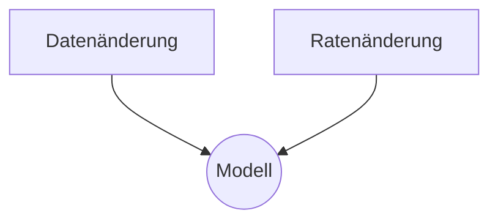
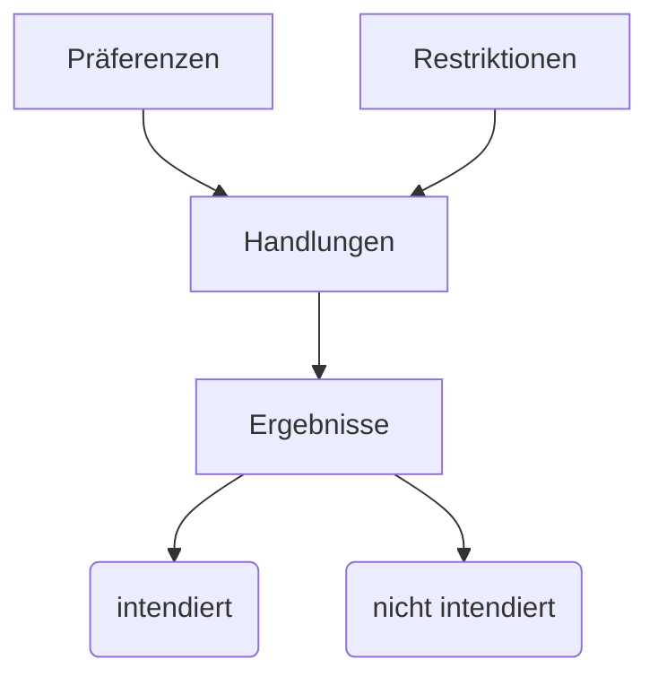
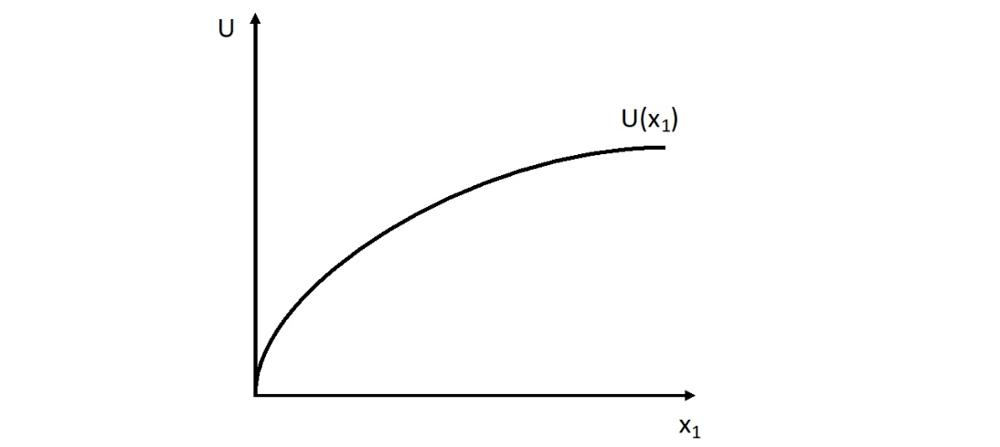
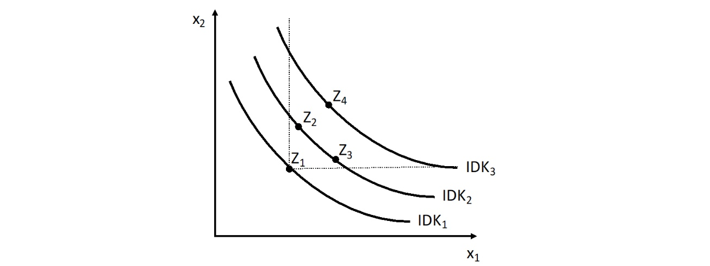
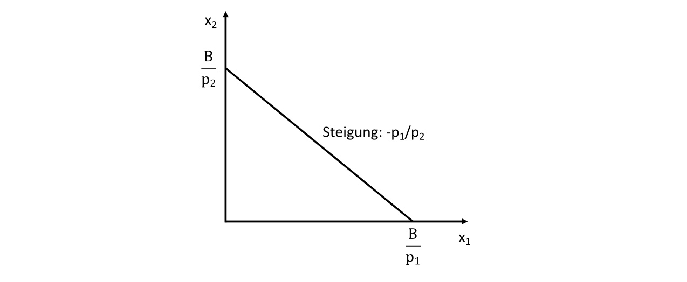
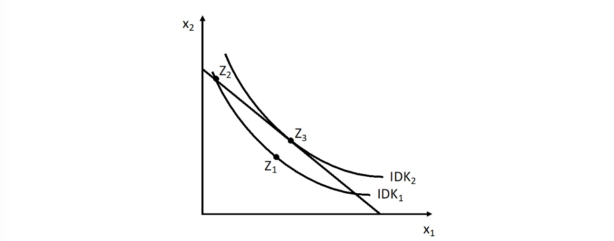

# 07.04.2022 Haushalte

##  Mikroökonomik
was ist Mikroökonomik?

### Modelle
- sind realistisch weil hilfreicher Output
- vereinfachen
- gibt verschiedene je nach Problem

## Modell der Haushalte
mikroökonomisches Modell des Haushalts: *Präferenzen-Restriktionen-Schema*

durch Änderungen der Restriktionen (Schocks) Änderungen der Ergebnisse interpretieren

Annahmen über Haushalte:
- Einkommenbudget *B*
- Einkauf von Gütern $x_{1}, x_{2},...$
- zu Marktpreisen $p_{1}, p_{2},...$
- darus Nutzen / Utility *U*
- Haushalte sind **nutzenmaximierend**


## Nutzenfunktion

Annahmen über Nutzenfunktion $U = U(x_1,x_2)$:

- durchgängig positiver Nutzen
- abnehmender Grenznutzen
    - dadurch Kurve *konkav*

Abbildung Nutzenkurve: 

mathematische Betrachtung:

1. Ableitung = Grenznutzen = *positiv*: $\frac{\partial U}{\partial x_1} > 0$
2. Ableitung = Steigung des Grenznutzens = *negativ*: $\frac{\partial^2 U}{\partial x_1^2} < 0$

## Indifferenzkurve

Nutzenfunktion erweitert auf Indifferenz zwischen zwei Gütern:
$$
d U = \frac{\partial U}{\partial x_1} * d x_1 + \frac{\partial U}{\partial x_2} * d x_2 = 0
$$

- $d U$ = absolute Veränderung Nutzen
- $\frac{\partial U}{\partial x_1} * d x_1$ = Grenznutzenfunktion * Veränderung der Menge $x_1$
- $=0$: unter Annahme konstanten Nutzens

```
also wie verändert sich die Zusammensetzung der Güter, wenn ich Nutzenniveau konstant halte. 
wenn x1 kleiner, dann x2 zwangsläufig größer etc.
```

### Substitutionsrate

aus dieser Gleichung lässt sich Substitutionsrate herleiten
$$
\frac{d x_2}{d x_1} = - \frac{\frac{\partial U}{ \partial x_1}}{\frac{\partial U}{ \partial x_2}} = | MRS |
$$

> **MRS**: *Marginal Rate of Substitution:* subjektive Substitutionswollen eines Haushalts (wieviel ist er bereit aufzugeben für ein Gut)

Darstellung als Indifferenzkurven



- beschreibt mögliche Güterkombinationen zwischen zwei Gütern
- auf einer Kurve = indiffernt gegenüber Kombination
- unter der Kurve = weniger Nutzen 


## Budgetgerade

Möglichkeitenraum, den ein Haushalt aufgrund seines Budgets hat

Formel: $B = p_1 x_1 + p_2 x_2 $


$$
\text{Budgetgleichung: } B = p_1 x_1 + p_2 x_2  \\
\text{Steigung: } \frac{d x_2}{d x_1} = - \frac{p_1}{p_2} = | MRT |
$$

> **MRT:** *Marginal Rate of Transformation:* objektives Substitutionskönnen des Haushalts über Preise



## Haushaltsgleichgewicht

Zusammenfügen beider Kurven



- $Z_1 \neq$  optimal, da nicht auf *B*
- $Z_2 \neq$ optimal, da weniger Nutzen als $Z_3$
- $Z_3 =$ optimal , da maximaler Nutzen und auf Budgetgerade

Wenn  $|MRT| = |MRS| \implies$ **optimal**
$$
\text{Formeln} \\
|MRS| = \frac{d x_2}{d x_1} \bigg|_U = 
- \frac{\frac{\partial U}{ \partial x_1}}{\frac{\partial U}{ \partial x_2}}  \gets  \text{subjektive Opport. Kost.}\\

|MRT| = \frac{d x_2}{d x_1} \bigg|_B =
- \frac{p_1}{p_2} 
\gets  \text{objektive Opport. Kost.} \\

\text{umgeschrieben: } 
\frac{ \frac{\partial U}{ \partial x_1}}{p_1} = 
\frac{ \frac{\partial U}{ \partial x_2}}{p_2}
$$
