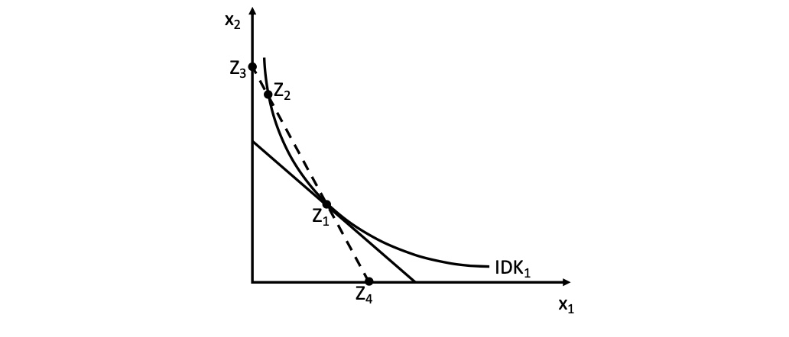
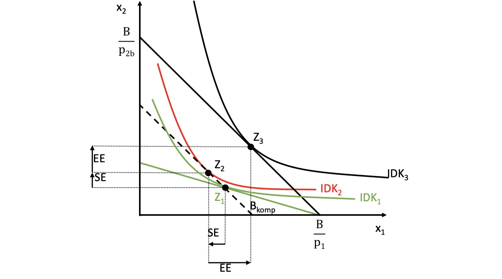
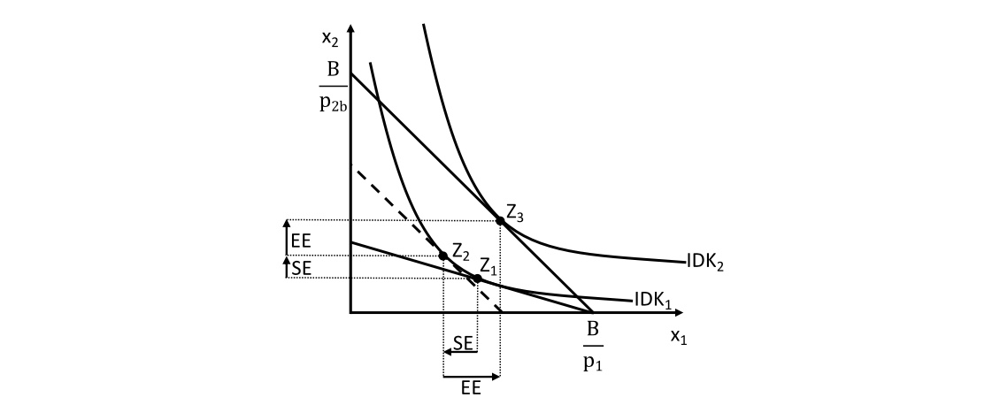
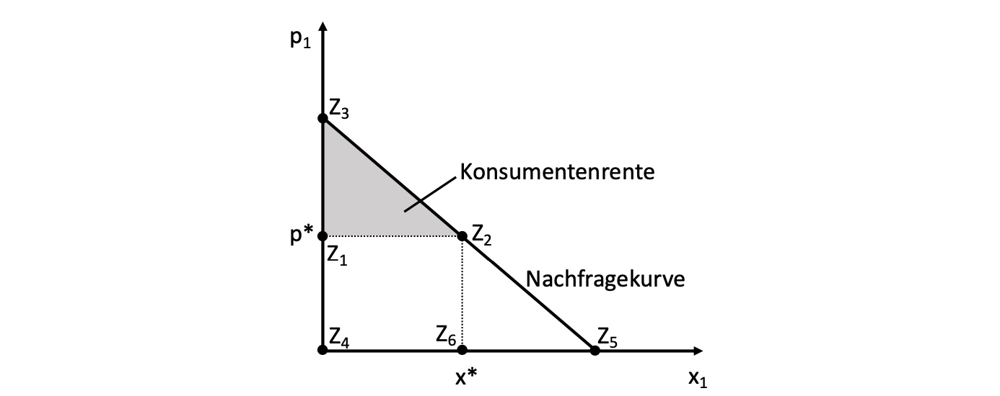
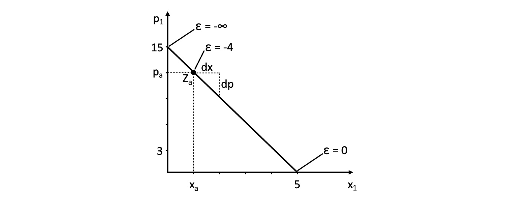
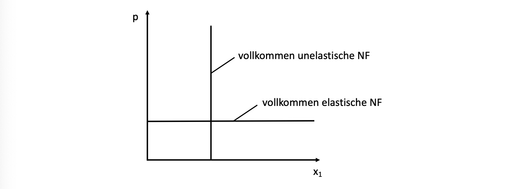

# 14.04.2022 Effekte und Schocks

## Einkommenseffekte

- Ausgangsgleichgewicht mit Budgetgerade $B_1$ 
- nun eine Einkommenserhöhung mit Budgetgerade $B_2$ 

Bereich zwischen $Z_4$ und $Z_5$ ist rationale neue Güterkombination 
- da nicht weniger Mengen eines Gutes als im Ausgangsequilibrium logisch
- außer wenn ein Gut inferior ist

## Substitutionseffekt

Effekt einer Marktpreisänderung (gestrichelte Linie)

- $x_2$ wird billiger
- $x_1$ wird teurer

### Zerlegung nach Slutsky

nun Zerlegung der Veränderung in Einkommenseffekt und Substitutionseffekt

- Durch Verschiebung der neuen Budgetgeraden zurück auf altes Optimum
- dedeutet dass neues Preisverhältnis, aber ohne einen Einkommenseffekt
- denknotwendig, dass Senkung von $P_2$ zu Erhöhung nachgefragter Menge $x_2$ führt

`=> Substitutionseffekt immer negativ!`

im Sinne von Preiserhöhung -> niedrigerer Konsum

### Zerlegung nach Hicks

statt Verschiebung Budgetgeraden Verschiebung IDK bis sie Ausgangsoptimum berührt

## Individuelle Nachfragekurve

durch Variation eines Gutes verschiedene Budgetgeraden und IDKs bestimmen

## Marktnachfrage

Aggregation der invividuellen Nachfragekurven zu Marktnachfrage

durch horizontale Addition:

### Rente

> **Rente:** Vorteil einer Leistung ohne Gegenleistung (wie bei Rentnern)

in der Mikroökonomik Konsumenten- und Produzentenrente

> **Konsumentenrente:** die Summe aller individuellen Zahlungsbereitschaften der zum Zuge kommenden Nachfrager den tatsächlich gezahlten Preis übersteigt

misst Wohlfahrt, den ein Konsument erfährt, weil etwas billiger ist als er sowieso zahlen würde

## Elastizität

Notation: 
$$
\epsilon_{x,p} 
= \frac{\Delta x \%}{\Delta p \%}  
\\ Umformung:
= \frac{ \frac{\Delta x}{x} }{\frac{\Delta p}{p}} 
= \frac{ \Delta x}{\Delta p} * \frac{p}{x}
= \frac{ \delta x}{\delta p} * \frac{p}{x}
= \frac{\frac{p}{x}}{\frac{\delta p}{\delta x}}
$$
`Elastizität ist dimensionslos!`  

Beispiel: 

Interpretation von $\epsilon = -4 \to$  1% Preisteigerung => 4% Mengenreduktion

### Allgemeine Interpretation: 

je höher $\epsilon$ , desto sensibler sind Haushalte auf Preisänderungen

| Wertbereiche               | Interpretation         |
| -------------------------- | ---------------------- |
| $\epsilon = 0$             | vollkommen unelastisch |
| $0 < \epsilon < 1$         | relativ unelastisch    |
| $ 1 \le \epsilon < \infty$ | relativ elastisch      |
| $\epsilon = \infty$        | vollkommen elastisch   |

Extremfälle: 
