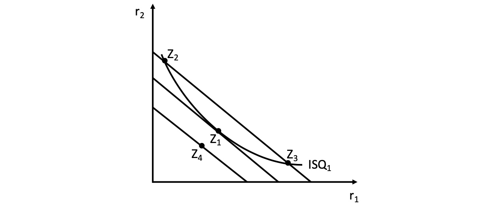

# 22.04.2022 Unternehmen und Rationalkalkül

Gegenseite zur Haushalte und Nachfrage: **Unternehmen** und **Angebot**

Annahmen:
- Kosten *C*
- Inputs/Faktoren $r_1,r_2$ mit Preisen $q_1,q_2$, oft:
    - $r_1$ = Arbeit mit Lohn $q_1$
    - $r_2$ = Kapital mit Zins $q_2$

- Maximierung von Gewinn *G*

## Isoquantenfunktion

aus Inputs $r_1,r_2$ wird Gut *x* hergestellt in Produktionsfunktion $x(r_1,r_2)$

- jedes weitere eingebrachte Input steigert, aber mit abnehmenden Grenzertrag

Produktionskurve für ein Gut: 

1. Ableitung = **Grenzproduktivität** > 0
2. Ableitung = **Steigerung der Grenzprod.** < 0

für Güterkombination: *Isoquantenkurve* (*iso* = gleich, *quant* = Menge -> gleiche Menge)

Bilden des totalen Differentials und umstellen:
$$
\text{Grenzprod. * Veraenderung erster Faktor + ...} \\

\to dx = \frac{\partial x}{\partial r_1} * \Delta r_1 + \frac{\partial x}{\partial r_2} * \Delta r_2  \\

\frac{\Delta r_2}{\Delta r_1} \bigg|_T
= -\frac{\frac{\partial x}{\partial r_1}}{\frac{\partial x}{\partial r_2}}
= MRTS \text{ (Marginal Rate of Technical Subst.)}
$$

hier sind das die Opportunitätskosten von $r_1$ (eine Einheit mehr von $r_1$, wieiviel Verzicht auf $r_2$)

> **MRTS:** Grenzrate der technischen Substitution, beschreibt technisches Substitutionskönnen des Unternehmens

## Isokostengerade

Kostenfunktion eines Unternehmens: $C = q_1 * r_1 + q_2 * r_2$ 
- unter Annahme eines perfekten Marktes

Darstellung mit *Isokostengerade*: 

> **MRMS:** (Marginal Rate of Market Substitution) das Preisverhältnis zweier Güter

## Produktionsgleichgewicht

in optimalen Punkt $Z_1$ ist $|MRTS| = |MRMS| $ 

Betrachtung mit *Lagrange-Funktion* 
$$
L = x(r_1,r_2) + \lambda * (C- r_1*q_1 - r_2 *q_2)
$$

- der hintere Summand ist bei rationalen Unternehmen 0
    - alles Geld wird verwendet für Faktoren
- $\lambda$ = Grenznutzen des Geldes 
    - wieviel mehr *x* wenn *C* um 1 Euro erhöht wird
    - = erste  Ableitung der Zielfunktion $\frac{\partial x}{\partial C}$

Ableitung der Lagrange Funktion
$$
\to \frac{\partial L}{\partial r_1} = 
\frac{\partial x}{\partial r_1} - \lambda*q_1 = 0
\\
\to \frac{\partial L}{\partial r_2} = 
\frac{\partial x}{\partial r_2} - \lambda*q_2 = 0
\\
\to \frac{\partial L}{\partial \lambda} = C- r_1*q_1 - r_2 *q_2
$$

### Exkurs marginale Zahlungsbereitschaft

> **MZB:** *persönliche* Bereitschaft zu Zahlung eines Preis

$$
P_1 = \frac{\frac{\partial U}{\partial x_1}}{\lambda} = MZB
$$

- $\lambda$ ist Faktor und U verändert sich => abnehmender Grenznutzen
- bei Menschen ohne Geld ist Grenznutzen des Geldes $\infty$ 
    - Dadurch $\lambda = \infty$ und *MZB = 0*
    - nur wenn Subsistenzeinkommen für Marktteilnehmer können sie sich überhaupt etwas kaufen
    - deswegen Sozialstaat! 

## Expansionspfad

beschreibt Verhältnis zwischen Inputs-Outputs, die bei Unternehmen nach oben offen sind (langfristig)

## Gewinnmaximierung

Gewinn = Erlös - Kosten: $G(x) = E(x) - C(x)$

- Maximum bei $\frac{\partial G}{\partial x} = \frac{\partial E}{\partial x} - \frac{\partial C}{\partial x} = 0$
- Grenzgewinn ist null und Grenzerlöse = Grenzkosten

nach Einsetzen der Erlösfunktion $p = \frac{\partial C}{\partial x}$

- Preis für Gut = Grenzkosten

 