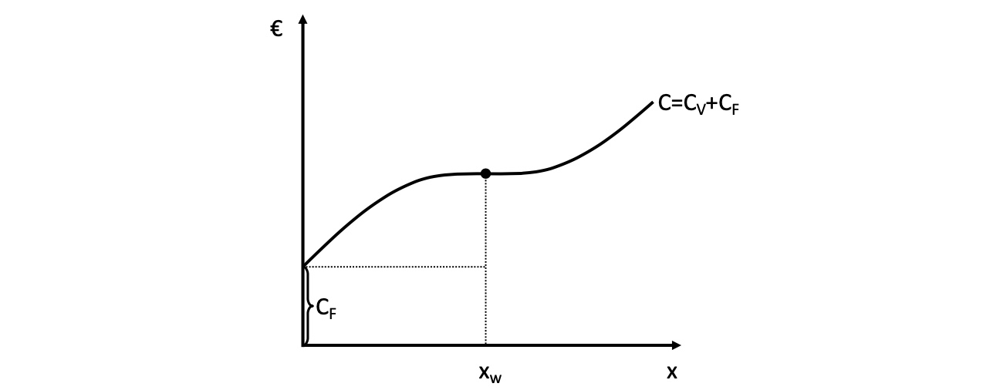
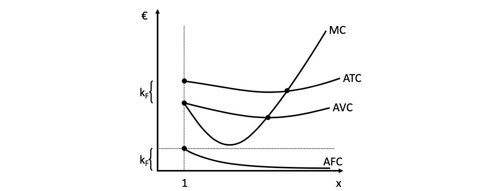
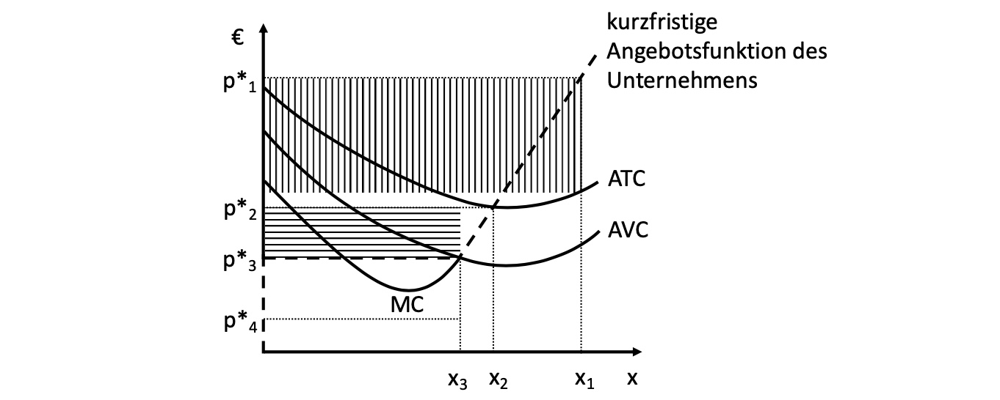
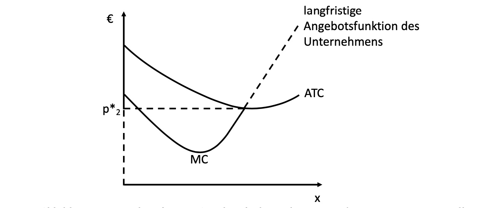
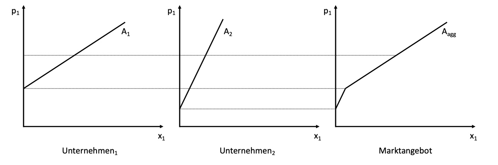
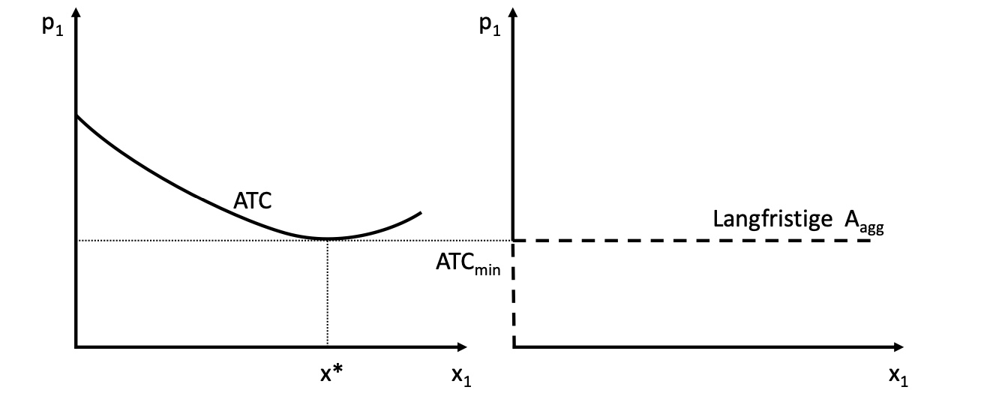
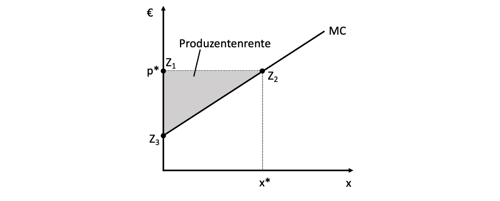
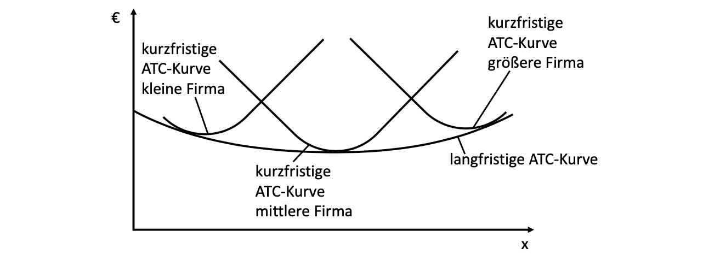

# 27.04.2022 Kurz- und Langfristiges Angebot

## Kostenkurve

Zusammensetzung aus fixen und variablen Kosten: $C = C_V+C_F$

Beispielhafte Kostenfunktion: 

daraus -> Durchschnittskosten / Einheit = $\frac{C}{x} = \frac{C_v}{x} + \frac{C_F}{x}$

- $\frac{C}{x}$ = *Average Total Cost*
- $\frac{C_V}{x}$ = *Average Variable Cost*
- $\frac{C_F}{x}$ = *average Fixed Cost*

- *AFC* und *AVC* = *ATC*-Kurve
- Minimum der *AVC* = links von Minimum der *ATC*
- wo *MC* < *ATC* hat diese negative Steigung

Beispielhafte math. Betrachtung: (bei kubischer Gleichung)
$$
\begin{aligned}
C &= ax^3 - bx^2 + cx + C_F \\
ATC &= \frac{C}{x} \to ax^2 - bx+c+\frac{C_F}{x} \\
AVC &= \frac{C_V}{x} \to ax^2 - bx+c \\
MC  &= \frac{dC}{dx} \to 3ax^2 - 2bx + c
\end{aligned}
$$

## Gewinnkalkül

`aus letzter Woche!`

Gewinn = Erlös - Kosten: $G(x) = E(x) - C(x)$

- Maximum bei $\frac{\partial G}{\partial x} = \frac{\partial E}{\partial x} - \frac{\partial C}{\partial x} = 0$
- Grenzgewinn ist null und Grenzerlöse = Grenzkosten

nach Einsetzen der Erlösfunktion $p = \frac{\partial C}{\partial x}$

- Preis für Gut = Grenzkosten = **optimal**

Preisakzeptanz eines Unternehmens kurzfristig

| Preis                     | Angebot        | Gewinn                                 |
| ------------------------- | -------------- | -------------------------------------- |
| $p^* \ge p^*2$            | gemäß MC-Kurve | positiver Gewinn => Champus und Kaviar |
| $p^*_2 \ge p^* \ge p^*_3$ | gemäß MC-Kurve | kurzfristig Verluste                   |
| $p^* \le p^*3$            | Einstellung    | Fixkosten sind verloren                |

- **merke:** kurzfristig sind Unternehmen bereit, Verluste bis Fixkosten hinzunehmen
    - also Preis zwischen ATC und AVC

langfristig:

## Marktangebot

### Kurzfristig

- kein Markteintritt / Austritt möglich (konstante Firmenanzahl)
- Annahme perfekten Wettbewerbs
- steigende Preise -> steigende Produktion aufgrund steigender Grenzkosten

### Langfristig

- Gewinne und Verluste führen zu Markteintritt / Austritt
    - Gewinn langfristig 0
- Annahme konstanter Skalenerträge
    - keine Economies of Scale

## Produzentenrente

analog zu Konsumentenrente

> **Produzentenrente:** Summe der Erlöse, die die Grenzkosten der Unternehmen übersteigt

unterscheidet sich kurzfristig und langfristig (geringer)

## Angebotselastizität

analog zu Nachfrageelastizität: 
$$
\epsilon_{x,p}  = \frac{\Delta x \%}{\Delta p \%}  = \frac{ \frac{\Delta x}{x} }{\frac{\Delta p}{p}}
$$

- langfristiges Angebot ist immer elastischer als kurzfristiges
- aufgrund Anpassungsreaktionen der Unternehmen

