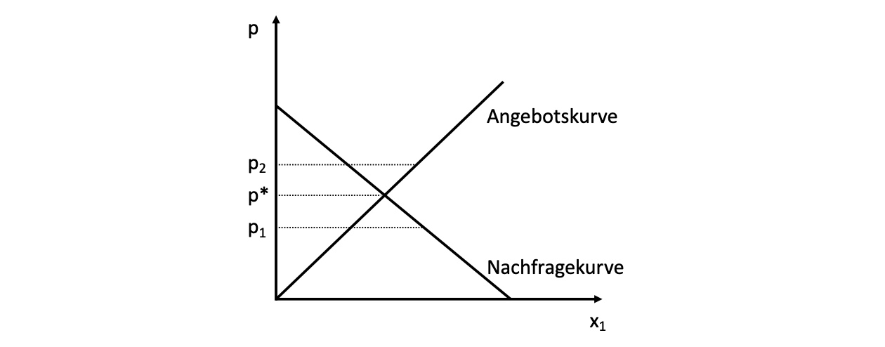
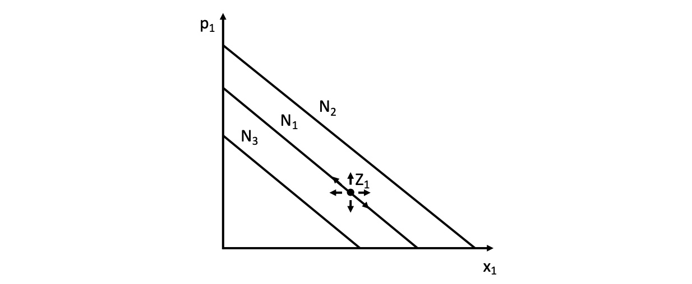
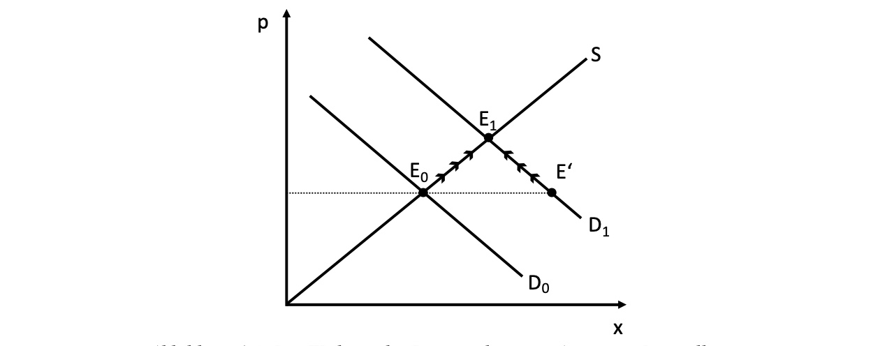
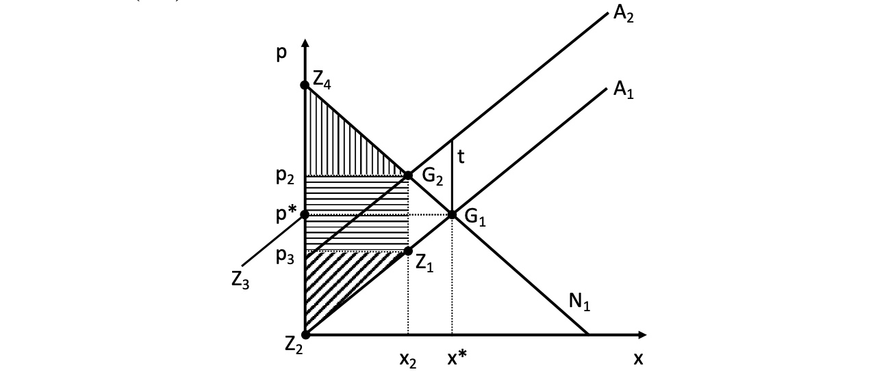
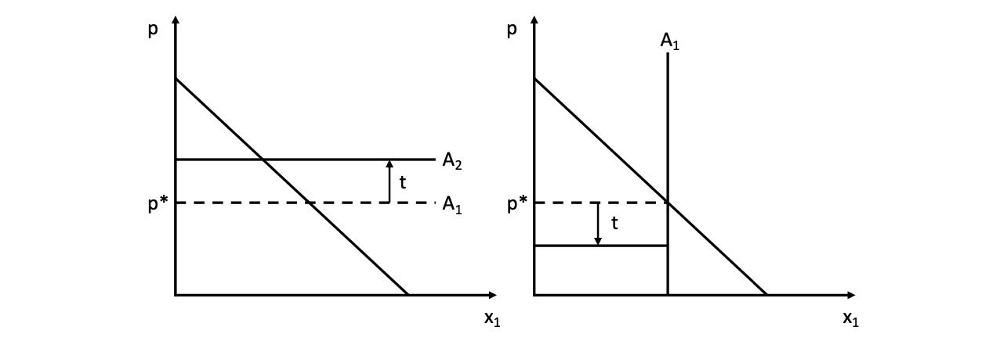
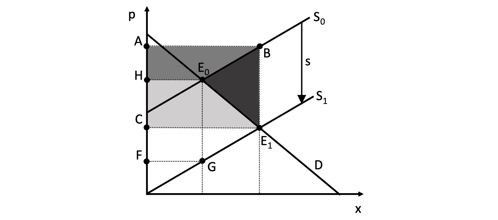

# 04.05.2022 Gütermarkt

> **Never start reasoning from price change**

- Preise sind endogen!
- Modell prüfen anhand eines exogenen Schocks

Der Gütermarkt:

bestehend aus Nachfrage und Angebotskurve

Nachfrage nach oben = Änderung des Einkommens = marginale Zahlungsbereitschaft Änderung

Nachfrage nach rechts = neue Nachfrager

## Kurvenbewegungen

Mögliche Arten der Bewegung der Nachfragekurve (exogen)

- Einkommensteigerung: $B \uparrow  = N\uparrow = (N_1\to N_2)$
- Einkommensminderung: $B \downarrow  = N\downarrow = (N_1\to N_3)$
- sinkender Preis Subsitutionsgüter: $p_2 \downarrow = N\leftarrow \ = (N_1\to N_3) $
- steigende Anzahl Nachfrager: $N \uparrow = N \rightarrow = (N_1 \to N_3)$

Verschiebungen = $\leftarrow, \rightarrow,\uparrow, \downarrow$

Veränderungen des Preises = entlang der Nachfragekurve

*analog für Angebotskurve*

- mehr Anbieter $S \rightarrow$
- Höhere Faktorkosten/Grenzkosten $S \uparrow$
    - da angebot abhängig von MC und die sich automatisch anheben
- weniger Anbieter $S \leftarrow$
- sinkende Grenzkosten $S \downarrow$

## Schocks

hier: Nachfrageüberschuss von $D_0$ auf $D_1$

- daraufhin Erhöhung des Angebots und
- Erhöhung des Preises

=`gesellschaftlich erwünschte nicht- intendierter Folgen intentionalen Handelns`

## Markteingriffe

### Steuerinzidenz

Gütersteuer von Höhe *t* auf Angebot:

- Angebotskurve verschiebt sich um *t* nach oben
- neuer Schnittpunkt mit Nachfragekurve

- Wohlfahrtsverlust (Deadweight Loss) zwischen $(G_1,G_2,Z_1)$
    - hier gleichmäßig getragen von Konsumenten und Produzenten
    - unabhängig davon, ob es eine Quellensteuer oder Verkaufsteuer ist (wer zahlt)
    - *genaue Verteilung der Steuerlast sonst abhängig von Elastizitäten!*
- horizontal schraffierte Fläche = staatliche Einnahmen

Verteilung der Steuerlast

- *Elastisches Angebot (links):* zu bestimmtem Preis jede Menge des Gutes anbietbar
    - vollständige Überwälzung der Steuerlast auf Verbraucher
- *unelastisches Angebot (rechts):* egal welcher Preis, Angebot fest
    - Unternehmen tragen Steuer vollständig
- **langfristig passen Unternehmen sich an!** und Verbraucher tragen Kosten immer

=> die unelastischere Seite trägt die Hauptlast 

> **beachte:** wichtig ist die Verwendung des Steueraufkommens. Wenn es für Finanzierung öffentlicher Güter genutzt wird, kann es schlussendlich zu positiven Netto-Wohlfahrtseffekten führen.

### Subventionierung

Stücksubventionen für die Anbieter => Verschiebung der Nachfragekurve

- Wohlfahrtszuwächse über/ unter dem neuen Dreieck
- aber Deadweight Loss in $B,E_1, E_0$ der Subventionen

> **beachte:** wenn Güter positive Externalitäten induzieren, kann eine Subventionierung sinnvoll sein
>
> analog bei negativen Externalitäten = Besteuerung

### Preisfestsetzungen

1:08:33 Zeit