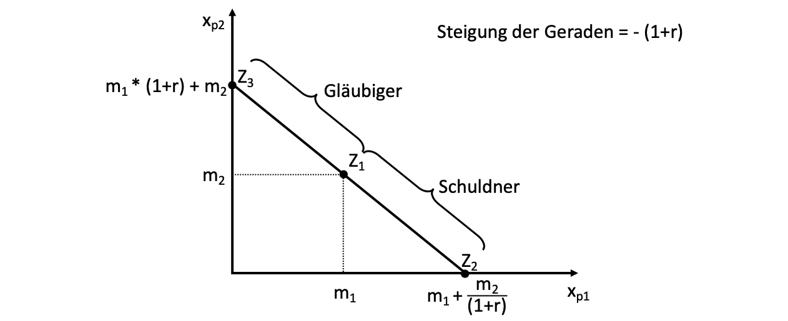
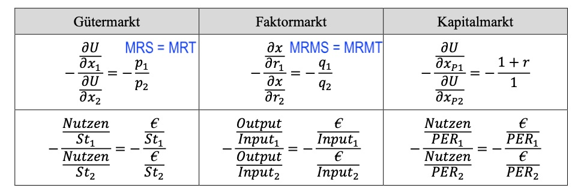
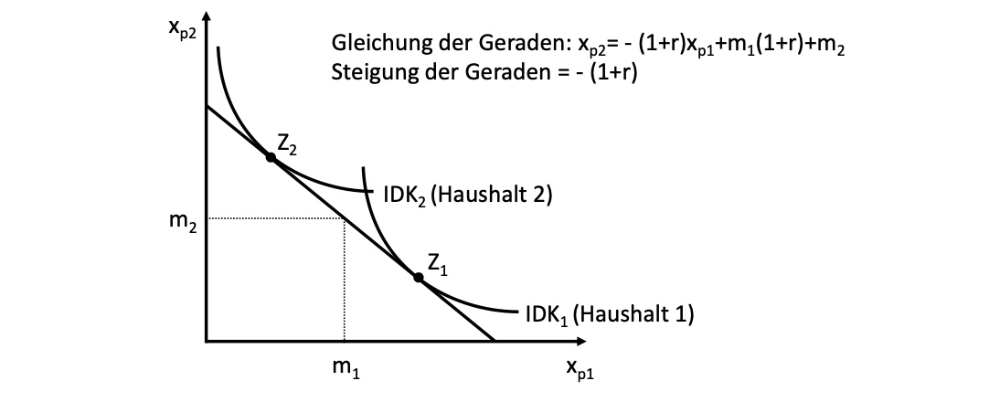
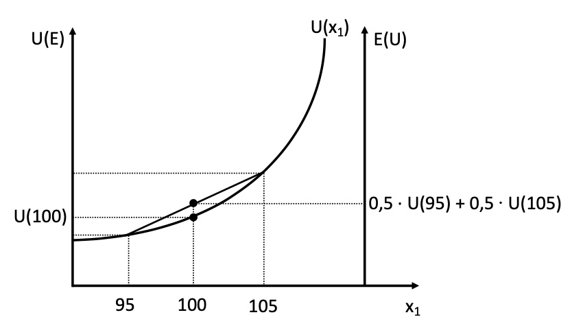
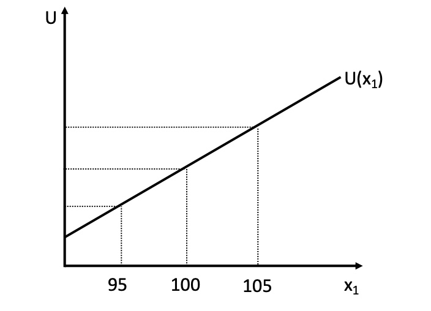
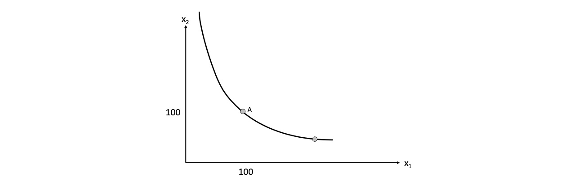

# 15.05.2022 Kapitalmarkt

*Was passiert, wenn Haushalte die Möglichkeit haben Geld anzulegen / zu leihen?*

=> Erfindung des Bankensystems!

## intertemporale Budgetbeschränkung

gegenwärtige Wert zukünftiger Auszahlungen $B = \frac{m}{(1+r)^t}$

- *m* = heutige Einzahlung
- *r* = Zins

Entscheidung eines Haushalts zwischen Gütern in zwei Perioden

- $x_{p2}, x_{p1}$ = Güter in Periode 1/2
- $m_1,m_2$ = Einkommen in Periode 1 / 2
- Preise der Güter sind konstant und gleich 1

Güterkonsum in Periode 2, wenn Haushalt in Periode 1 anlegen kann:
$$
x_{p2} = m_2 + (m_1 -x_{p1}) + r*(m_1 - x_{p1}) \\
= m_2 + (1+r) * (m_1 - x_{p1})
$$
alternativ: Haushalt kann in Periode 1 Geld leihen 
$$
x_{p2} = m_2 - (x_{p1} - m_1) - r*(x_{p1} - m_1) \\
= m_2 - (1+r)*(x_{p1} - m_1) \\
= m_2 + (1+r)*(m_1-x_{p1})
$$
= gleiche Mengenfunktion wie davor
$$
\text{B in Zukunftswerten:}\\
(1+r) * x_{p1} + x_{p2} = (1+r) * m_1 + m_2 \\
\text{B in Gegenwartswerten:}\\
x_{p1} + \frac{x_{p2}}{(1+r)} = m_1 + \frac{m_2}{(1+r)}
$$

## intertemporale Konsumpräferenzen

wie lässt sich die Präferenz eines Haushalts zwischen zwei Zeitpunkten beschreiben?

Ziel: maximiere den Gesamtnutzen in beiden Perioden

Lagrange Funktion aufstellen: 
$$
\begin{aligned}
L = U(x_{p1}, x_{p2}) &+ \lambda \ [m_1 * (1+r) + m_2 - (1+r)x_{p1} - x_{p2}] \\
&\to \frac{\partial L}{\partial x_{p1}} = \frac{\partial U}{\partial x_{p1}} - \lambda * (1+r) = 0 \\
& \to \frac{\partial L}{\partial x_{p2}} = \frac{\partial U}{\partial x_{p2}} - \lambda  = 0 \\
&\to \frac{\partial L}{\partial \lambda} = m_1 * (1+r) + m_2 - (1+r)x_{p1} - x_{p2} = 0 \\
\end{aligned}
$$
Umstellen für die Zeitpräferenzrate
$$
\implies \frac{\frac{\partial L}{\partial x_{p1}}}{\frac{\partial L}{\partial x_{p2}}}  = 1+r \text{ oder } \frac{MU(x_{p1})}{MU(x_{p2})} = 1+r \\
r = \frac{MU(x_{p1})}{MU(x_{p2})} - 1 \\
r = \frac{MU(x_{p1})}{MU(x_{p2})}- \frac{MU(x_{p2})}{MU(x_{p2})} \\
r = \bold{\tau = \frac{MU(x_{p1})- MU(x_{p2})}{MU(x_{p2})}}
$$
Analogie Betrachtungen dieser Formeln

Betrachtung der temporalen Konsumpräferenzen

- Haushalt 1: hohe Gegenwartspräferenz in Punkt $Z_1$, Verschuldung in Periode 1
- Haushalt 2: hohe Zukunftspräferenz, Kapitalanlage in Periode 1

Berechnung der Zinsrate: *Realzins = Nominalzins - Inflationsrate*

## Risikofreude

Entscheidungen von Akteuren sind risikobehaftet, Bereitschaft zu Risiko = individuell

- Mögliche Wahrscheinlichkeitsverteilung einer Entscheidung $W = [s_1,...,s_n \ ; \ \pi_1, ...,\pi_n]$
- mit Ergebnissen $(s_1,..,s_n)$ und Wahrscheinlichkeiten $(\pi_1,...,\pi_n)$

### Beispiel Lotterie

- 100€ Ausgangsvermögen
- 5€ Losticket, 
- 50% Gewinnchance, 10€ Gewinn

- $W = [95,105; 0.5,0.5]$
- Erwartungswert: $105*0.5 + 95*0.5 = 100$

Entscheidung mithilfe von Neumann-Morgenstern-Nutzenfunktion des *Erwartungswerts U(s)* 
$$
U(s) =& U(s_1) * \pi_1 + U(s_2) * \pi_2 + ... + U(s_n) * \pi_n \\
U(s) =& 0.5 * U(95) + 0.5 * U(105)
$$
Verhalten dann abhängig von persönlicher Nutzenkurve des Loskäufers

| Käufer 1 (risikoavers)                                    | Käufer 2 (risikofreudig)                                  | Käufer 3 (risikoneutral)                                  |
| --------------------------------------------------------- | --------------------------------------------------------- | --------------------------------------------------------- |
|  |  |  |
| strikt konkav                                             | strikt konvex                                             | Strikt geradlinig                                         |
| $U(100) > 0.5 * U(95) + 0.5 * U(105)$                     | $U(100) < 0.5 * U(95) + 0.5 * U(105)$                     | $U(100) = 0.5 * U(95) + 0.5 * U(105)$                     |

- Risikoaverser Käufer ist bereit, Versicherung gegen Risiko anzunehmen
    - Prämie in Höhe des Sicherheitsäquivalentes
    - wenn er gezwungen wäre zu spielen!

## Übung

### Aufgabe 1: intertemporaler Konsum

Konsument woll über zwei Jahre optimieren, ohne Möglichkeit anzulegen / Schulden zu machen!

Nutzenfunktion: $U(x_1,x_2) = x_1^{0.5} x_2^{0.5}$

- für Funktionsgleichung nach $x_2$ umstellen (Ordinaatenachse)

$$
\frac{U}{x_1^{0.5}} = x_2^{0.5} \to x_2 = \frac{U^2}{x_1}
$$

für *U=100* : $x_2 = 10000/x_1$

### 2 Aufgabe: Intertemporale Budgetgerade

Haushalt mit Einkommen = 100 GE pro Jahr und r=5%

