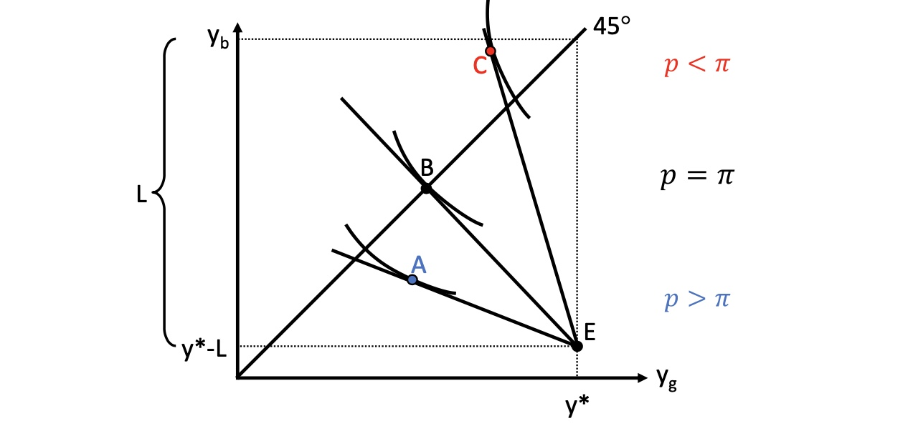

# 20.05.2022 Versicherung

mögliche Fälle

| Outcomes       | keinen Schaden | Schaden             |
| -------------- | -------------- | ------------------- |
| **ohne Vers.** | $y^*$          | $y^* -L$            |
| **mit Vers.**  | $y^*- (p*q)$   | $y^* - L+q - (p*q)$ |

- y* = yield
- L = loss 
- p = Versicherungsprämie
- q = Versicherungssumme 

## Nachfrage nach Versicherungen

- Fälle *g = good* und *b = bad*
- Abszisse = good Outcome
- Ordinate = bad Outcome

- 45° Linie = gleichmäßige Verteilung zwischen Eintreten beider Fälle
    - Haushalt ist dann indifferent zwischen beiden Fällen: $MU_{y_b}=MU_{y_g}$
- Ausgangsituation E ohne Versicherung
    - im guten Fall: $y^*$
    - im schlechten Fall: $y^* - L$ 
- Punkt B: mit Versicherung
    - im guten und schlechten Fall zwischen $y^*$ und  $y^* - L$

### Substiutionskönnen

Marginal Rate of Transformation: $\frac{1-p}{p} = MRT$ 

- Substitutionskönnen zwischen Einkomen im guten / schlechten Fall
- durch aufgeben von 1€ -> im Schadensfall $\frac{1-p}{p}$ Euro mehr

### Substitutionswollen

Schadenswahrscheinlichkeit = $\pi$

$$
\text{Nutzenerwartungswert: } EU = \pi * U(y_b)+ (1- \pi)* U(y_g) \\
\to \text{totales Differential: } dEU = 
\pi * \frac{\partial U}{\partial y_b} * dy_b 
+ (1- \pi)* \frac{\partial U}{\partial y_g} * dy_g \\
\to \frac{d y_b}{d y_g} = - \frac{1-\pi}{\pi} * \frac{\frac{\partial U}{\partial y_g}}{\frac{\partial U}{\partial y_b}} = MRS
$$
höhere Schadenswahrscheinlichkeit => höhere Bereitschaft für Verzicht

### Gleichgewicht

in optimalen Punkt: MRS = MRT mit festem $\pi$ !
$$
\frac{1-\pi}{\pi} * \frac{MU_{y_g}}{MU_{y_g}} = \frac{1-p}{p}
$$
Verhalten bei verschiedenen Prämiensätzen:

- bei fairer Prämie: Haushalt wählt Vollversicherung
    - $p = \pi$ ist aktuarisch fair
- bei unfairer Prämie $p > \pi$: Haushalt wählt Unterversicherung, Punkt A
- Bei gönnerhafter $p < \pi$: Haushalt überversichert, Punkt C

## Probleme asymmetrischer Information

### Adverse Selection

**Problem:** ungenaue Information der Versicherung über exakte Schadenswahrscheinlichkeit 

Informationsasymmetrie **vor Abschluss**

Beispiel: zwei Haushalte mit unterschiedlichen Risiken $\pi_1 >\pi_2$

- Haushalt mit hohem Risiko verschleiert sein wahres Risiko
- Versicherung schützt sich, indem es hohe Risikoprämien verlangt
- oder nur noch Teilversicherungen anbietet

= **adverse Selection** = negativauslese = risikolose Haushalte werden verdrängt

### Moral Hazard

Problem für Versicherer nach Abschluss:

- Haushalt lässt $\pi$ ansteigen
- oder vergrößert *L*

Informationasymmetrie **nach Abschluss**

### Marktversagen

Autoverkauf im Gebrauchtmarkt: Risiko eines schlechten Autos

große Unsicherheit => niedrigere Nachfrage => Marktineffizienz

**Lösung:** Verkäufer gibt Garantieerklärung

