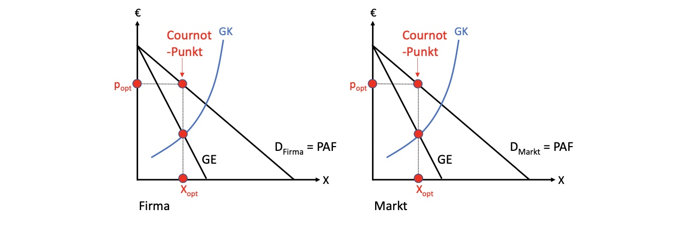
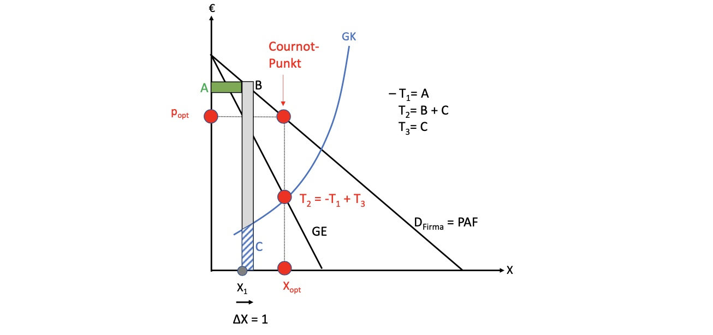
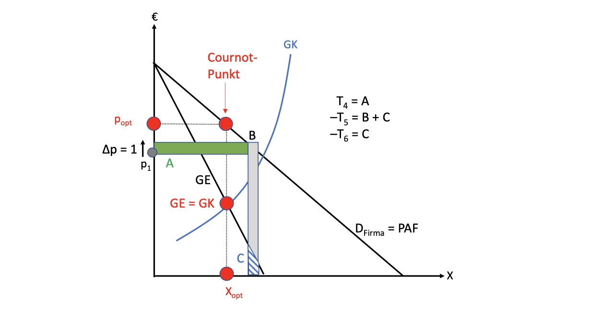

# 21.05.2022 Monopol und Oligopol

bisher betrachteter Markt: 


> **Polypol**: Wettbewerbsmarkt mit vielen Teilnehmern ohne Preissetzungsfähigkeit

Entscheidungsvariable = Menge zu gegebenem Preis = *Grenzkosten*

Jetzt: **Monopol!**


- Angebot basiert nicht mehr auf Grenzkosten
- sondern Grenzerlöse GE
- Preis ist für Monopolisten nicht fest

## Mengenfixierung

Gedanken des Monopolisten bei Verkauf einer Einheit:

1. Verkauf = zusätzlicher Erlös
2. Einheit produzieren = Grenzkosten
3. zusätzliche Einheit senkt Preis aller infra-marginalen Einheiten, die davor zu höherem Preis verkaufbar waren **!**

---

Monopolgewinn: $Gewinn = Umsatz - Kosten = p(X) * X - K(X)$
- Preis ist abhängig von Menge!
- deswegen Nachfrage = Preis-Absatz-Kurve *PAF*

wie immer: ableiten nach X und nullsetzen
$$
\frac{\partial G}{\partial X} = 
\underbrace{\frac{\partial p}{\partial X} * X}_{T_1} +
\underbrace{p* \frac{\partial X}{\partial X}}_{T_2} - 
\underbrace{\frac{\partial K}{\partial X} }_{T_3}
= 0 \text{  mit } \frac{\partial X}{\partial X} = 1  \\
\to T_1 + T_2 - T_3 = 0
$$

- $T_1$ = infra-marginale Umsatzwirkung einer Produktionsmengenerhöhung
- $T_2$ = marginale Umsatzwirkung
- $T_3$ = Grenzkosten

Gewinnregel für Monopol: $T_2 = -T_1+ T_3$

Effekt einer Mengenerhöhung um 1

- senkt Preis von allen Einheiten = A
- erhöht Grenzkosten = C
- erweitert Erlöse = B + C

optimale Menge: **GK = GE** (Grenzerlös = Grenzkosten)

- Merke: erst Menge bei Schnittpunkt ablesen, dann auf PAF projizieren für Preis


## Preisfixierung

Alternativ: Monopol kann einfach Preis fixieren und Nachfrager Menge entscheiden lassen

Modell: $G [X(p)] = p*X(p)- K[X(p)]$ mit Entscheidungsvariable *p*
$$
\frac{\partial G}{\partial p} = 
\overbrace{\frac{\partial p}{\partial p} * X}^{T_4} +
\overbrace{p* \frac{\partial X}{\partial p}}^{T_5} - 
\overbrace{\frac{\partial K}{\partial X} * \frac{\partial X}{\partial p}}^{T_6}
= 0 \text{  mit } \frac{\partial p}{\partial p} = 1  \\
\to T_4 + T_5 - T_6 = 0
$$

- $T_4 +T_5$ = Grenzumsatz einer Preiserhöhung 
- $T_6$ = Grenzkosten



## Amoroso-Robinson-Formel

$$
p = \frac{\frac{\partial K}{\partial X} }{ 1- \frac{1}{|\varepsilon_{x,p|}}}
$$

Aussagen:

- wenn Elastizität unendlich; Monopolpreis = Grenzkosten = Polypolbedingung
- Monopolpreis über Grenzkosten, wenn Elastizität > 1
    - Monopolisten wollen nicht in unelastischen Bereich


## Wohlfahrtseffekte


Effekte eines Monopols auf Konsumenten

- verlieren *e* = Wohlfahrtsverluste 
- *c+d* an Produzenten

auf Produzenten:

- verlieren *h* = Wohlfahrtsverluste
- erhalten *c+d* 
- *c+d > h* = profitieren davon


```
Aber: Monopole können als "Belohnung" für Innovation sinnvoll sein, siehe Patentrecht, dass eine Monopolstellung temporär zusichert!
```

jedoch sollte man immer vorsichtig sein, Monopole in die Hand des Marktes zu geben


