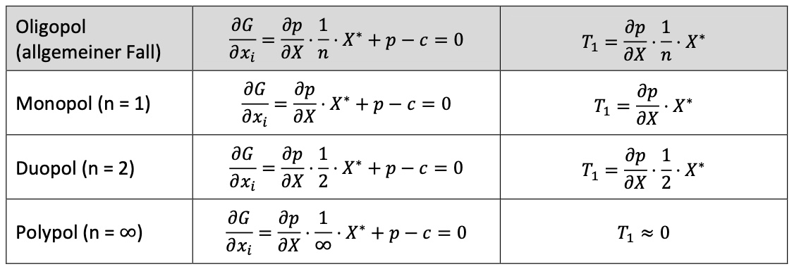
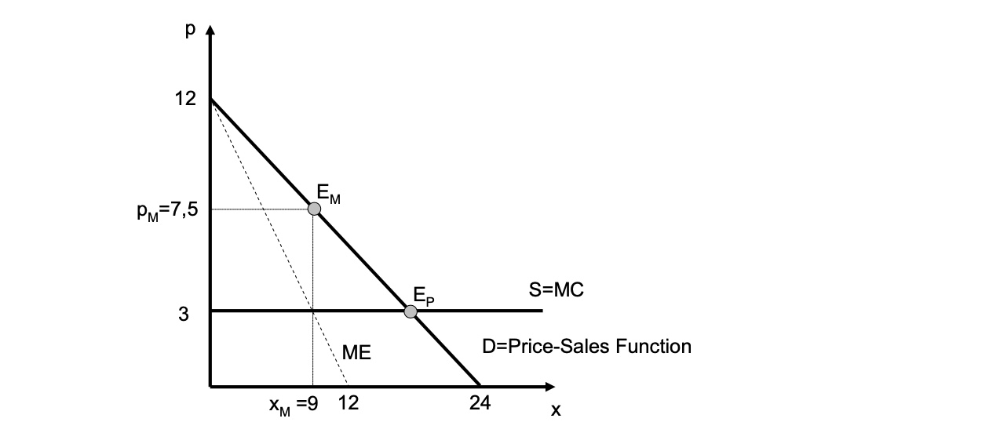

# 21.05.2022 Monopol und Oligopol

bisher betrachteter Markt: 


> **Polypol**: Wettbewerbsmarkt mit vielen Teilnehmern ohne Preissetzungsfähigkeit

Entscheidungsvariable = Menge zu gegebenem Preis = *Grenzkosten*

## Monopol

Jetzt: **Monopol!**


- Angebot basiert nicht mehr auf Grenzkosten
- sondern Grenzerlöse GE
- Preis ist für Monopolisten nicht fest

### Mengenfixierung

Gedanken des Monopolisten bei Verkauf einer Einheit:

1. Verkauf = zusätzlicher Erlös
2. Einheit produzieren = Grenzkosten
3. zusätzliche Einheit senkt Preis aller infra-marginalen Einheiten, die davor zu höherem Preis verkaufbar waren **!**

---

Monopolgewinn: $Gewinn = Umsatz - Kosten = p(X) * X - K(X)$
- Preis ist abhängig von Menge!
- deswegen Nachfrage = Preis-Absatz-Kurve *PAF*

wie immer: ableiten nach X und nullsetzen
$$
\frac{\partial G}{\partial X} = 
\underbrace{\frac{\partial p}{\partial X} * X}_{T_1} +
\underbrace{p* \frac{\partial X}{\partial X}}_{T_2} - 
\underbrace{\frac{\partial K}{\partial X} }_{T_3}
= 0 \text{  mit } \frac{\partial X}{\partial X} = 1  \\
\to T_1 + T_2 - T_3 = 0
$$

- $T_1$ = infra-marginale Umsatzwirkung einer Produktionsmengenerhöhung
- $T_2$ = marginale Umsatzwirkung
- $T_3$ = Grenzkosten

Gewinnregel für Monopol: $T_2 = -T_1+ T_3$

Effekt einer Mengenerhöhung um 1

- senkt Preis von allen Einheiten = A
- erhöht Grenzkosten = C
- erweitert Erlöse = B + C

optimale Menge: **GK = GE** (Grenzerlös = Grenzkosten)

- Merke: erst Menge bei Schnittpunkt ablesen, dann auf PAF projizieren für Preis


### Preisfixierung

Alternativ: Monopol kann einfach Preis fixieren und Nachfrager Menge entscheiden lassen

Modell: $G [X(p)] = p*X(p)- K[X(p)]$ mit Entscheidungsvariable *p*
$$
\frac{\partial G}{\partial p} = 
\overbrace{\frac{\partial p}{\partial p} * X}^{T_4} +
\overbrace{p* \frac{\partial X}{\partial p}}^{T_5} - 
\overbrace{\frac{\partial K}{\partial X} * \frac{\partial X}{\partial p}}^{T_6}
= 0 \text{  mit } \frac{\partial p}{\partial p} = 1  \\
\to T_4 + T_5 - T_6 = 0
$$
- $T_4$ = Umsatzerhöhung einer Preiserhöhung 
- $T_5$ = Umsatzverlust uafgrund gestiegenem Preise 
- $T_6$ = Grenzkosten


### Amoroso-Robinson-Formel

$$
p = \frac{\frac{\partial K}{\partial X} }{ 1- \frac{1}{|\varepsilon_{x,p|}}}
$$

Aussagen:

- wenn Elastizität unendlich; Monopolpreis = Grenzkosten = Polypolbedingung
- je niedriger Elastizität => höhere Monopolpreisaufschlag
- Monopolpreis über Grenzkosten, wenn Elastizität > 1
    - Monopolisten wollen nicht in unelastischen Bereich


### Wohlfahrtseffekte


Effekte eines Monopols auf Konsumenten

- verlieren *e* = Wohlfahrtsverluste 
- *c+d* an Produzenten

auf Produzenten:

- verlieren *h* = Wohlfahrtsverluste
- erhalten *c+d* 
- *c+d > h* = profitieren davon


```
Aber: Monopole können als "Belohnung" für Innovation sinnvoll sein, siehe Patentrecht, dass eine Monopolstellung temporär zusichert! 
jedoch sollte man immer vorsichtig sein, Monopole in die Hand des Marktes zu geben!
```

## Monopson

Monoposonunternehmen: ein Nachfrager gegenübr vielen Anbietern, bspw. im Arbeitsmarkt

Gewinnkalkül des Monopsons: $G(L) = p*X(L,K) - \bold{w(L)} * L - i*K-C_F$ 
- merke: Lohnsatz ist abhängig von Arbeitsangebot des Unternehmens


Monopsonoptimum: Ableitung nach L:
$$
\frac{\partial G}{\partial L} = p*\frac{\partial X}{\partial L}- \frac{\partial w(L)}{\partial L} * L - w(L)*1 = 0 \\
\to \underbrace{p*\frac{\partial X}{\partial L}}_{WGP_L} = 
\underbrace{w + \frac{\partial w(L)} {\partial L} *L}_\text{Grenzausgaben}
$$

- **Erinnerung**: normales Unternehmen: $WGP_L = w$ für Optimum von L

graphische Darstellung: *Monopson vs Polypol*


alternativ auch wieder Preisfixierung möglich

## Oligopol

generelles Modell von Polypol bis Monopol

- Angebotsmarkt mit *n* wenigen Unternehmen 
- individuelle Produktionsmenge $x_i$
- Angebotsmenge $X = \sum_{i=1}^n x_i$

Gewinnmaximierungskalkül
$$
G(x_i) = p(X) * x_i - c * x_i \\
\to \frac{\partial G}{\partial x_i} = 
\underbrace{\frac{\partial p}{\partial X} * \frac{\partial X}{\partial x_i} * x_i}_{T_1}
+ \underbrace{p*1}_{T_2} -\underbrace{c*1}_{T_3} = 0
$$
- T1 = inframarginaler Umsatzeffekt < 0
- T2 = marginaler Umsatzeffekt > 0
- T3 = Kosten > 0

Optimum: $T_2 = -T_1 + T_3$

### Symmetrieannahme

im Gliehcgewicht alle Unternehmen gleiche Produktion
$$
X^* = \sum_{i=1}^n x_i^* = n * x_i^*
\to x_i = \frac{1}{n} X^* \\
\text{Einsetzen in Gewinnableitung: }\\
\frac{\partial G}{\partial x_i} = 
\frac{\partial p}{\partial X} * \frac{1}{n}* X^*
+ p -c = 0
$$


bei steigenden Zahlen von Unternehmen => sinkender T1



inframarginale Kosten nächstes Produktes tendieren gegen 0

Gleichgewichtsmengen bei verschiedenen Marktformen:


auf Monopolmarkt ist Menge die Hälfte des Optimums, mit steigenden Teilnehmern sinkt Preis und steigt Menge

Unternehmen kannibalisieren sich ihre Gewinne gegenseitig, da sie nicht exakt ihren Anteil an der Monopolmenge anbieten, sondern etwas mehr


## Monopolistischer Wettbewerb

Monopolunternehmen konkurrieren gegen Substitutionsgüter (bspw. Automobilanbieter)

Darstellung (kurz und langfristig):

in der langen Frist nähern sich die Totalen Durchschnittskosten TDK der Preis-Absatz-Funktion PAF an => Nullgewinn


## Überblick

Charakteristika der verschiedenen Marktformen


## Übung

### 1. Marktgleichgewicht

- Kostenfunktion $C(x) = 3x$
- Nachfrage: $x=-2p+24$
    - $\to p(x) = -\frac{1}{2}x+12 \\$

für Monopol Optimum: *MC = ME* (Grenzerlös)

allgemeines Optimum für Monopol:
$$
\frac{\partial p(x)}{\partial x} x+p = MC
$$
Hier:
$$
C = 3x \to MC = 3 \\
E = p(x)\cdot x \to E=-\frac{1}{2}x^2+12x \\
ME = -x+12 \\
$$
Gleichsetzen
$$
ME = MC \\
-x+12 = 3 \implies \bold{x^* = 9} \\
p(9) = -\frac{1}{2}9+12 \to \bold{p^* = 7.5}
$$
Graphisch: 

### 2. Wohlfahrtswirkungen

