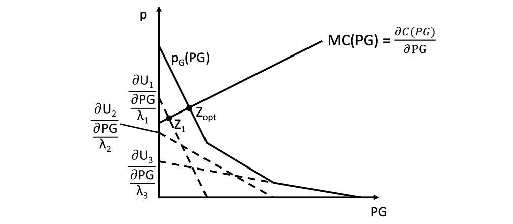
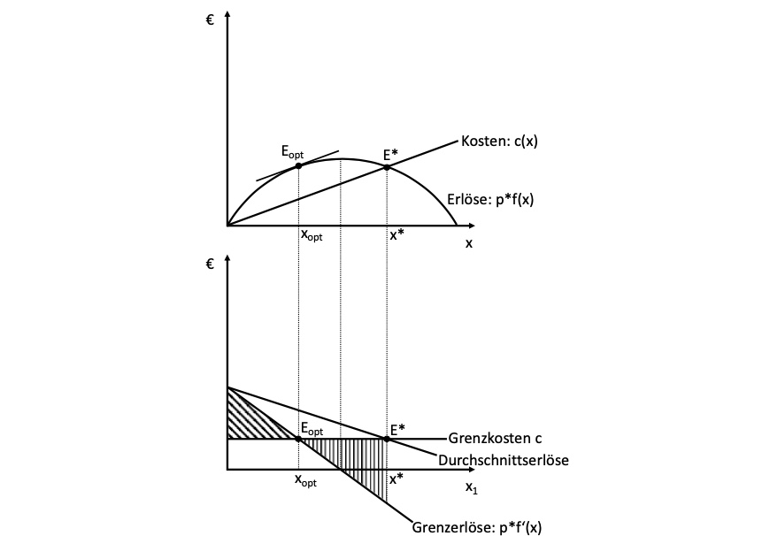
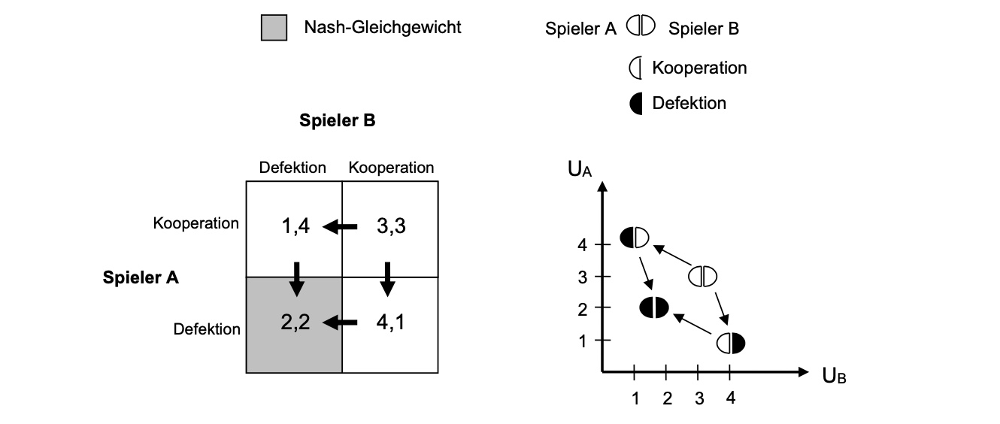

# 31.05.2022 Öffentliche Güter

Kategorisierung von Gütern:

- Rivalität: Güter können nur einmal genutzt werden
    - Frage der situativen Knappheit
- Auschließbarkeit: andere können von Konsum ausgeschlossen werden
    - Frage der juristischen Definition

| *Güter*                    | Rivalität   | Nicht-Rivalität |
| -------------------------- | ----------- | --------------- |
| **Auschließbarkeit**       | private G.  | Clubgüter       |
| **Nicht-Auschließbarkeit** | Allmende G. | öffentliche G.  |

Allmende auch *Common-Pool-Resources CPR*

Güter sind nicht fest einer Kategorie zugeordnet! 

- bspw. Straßen sind abhängig von Verkehrsmenge und Maut anders
    - **Clubgut**: Mautstraße
    - **Privates G**.: Mautstraße mit viel Verkehr
    - **öffentliches Gut**: deutscher Feldweg in Buxtehude Nord
    - **CPR / Allmende**:  deutsche volle Autobahnen 

## Trittbrettfahren

Problem: für öffentliche/CPR Güter will niemand zahlen, da man nicht ausgeschlossen werden kann => **Trittbrettfahrerproblem** = Bereitstellungsproblem

- Staat bietet Güter als Clubgüter an (für Einwohner gegen Steuern)
- durch Verknappung werden öffentliche zu CPR 
    - Lösung mithilfe Umwandlung in private Güter (Treibhauszertifikate)

## Bereitstellung Ö.G.

*wie stellt man öffentliche Güter effizient bereit?*

bei privaten Gütern die marginale Zahlungsbereitschaft aggregierten, ebenso bei öffentlichen Gütern

Modellierung:

- Öffentliches Gut = Public Good = *PG*
    - Kosten $C(PG)$
    - Individueller Nutzen = $U_i(PG)$
- Gesamtgesellschaftliche Zahlungsbereitschaft $p_G$
    - Summe der individuellen Zahlungsbereitschaften $p_i = \frac{\frac{\partial U_i}{\partial PG}}{\lambda_i}$

nur Haushalt 1 wäre hier bereit, das Gut alleine herzustellen und würde von den anderen beiden ausgebeutet => Staat übernimmt Aufgaben

Besteuerung schafft die Basis für die Bereitstellung von Ö.G.

## Allmende Güter

Beispiel: Aplenwiese, die von allen gemeinsam genutzt werden kann

- *x* Kühe mit Produktionsfunktion *f(x)*
- Milchpreis *p*
- Kosten einer Kuh *c*
- gemeinsamer Tank mit geteiltem Ertrag über Durchschnitt für alle

Gewinnfuntkion: $G(x) = p \cdot f(x) - c \cdot x$

normales Gewinnmaximum: $p \cdot f'(x^{opt}) = c$

bei Allmende: $p \cdot f(x) \cdot \frac{x_i}{X}-x_i = c$

- langfristig ist Gewinn 0, und das Allmende Gut wertlos

=> **Tragik der Allmende**

Möglichkeiten, dieses Problem zu verhindern:

- Weidegebühr pro Kuh
- Parzellierung der Wiese
- Mengenrestriktion der Kühe

## Spieltheorie

Analyse der Strategien 

- einer Gruppe von Akteuren (meist 2) 
- bei begrenzten Handlungsalternativen (meist 2)

Darstellung mit Pay-Off-Matrix

**Beispiel Kartell**

- Kartellmitglieder sind alle am besten gestellt, wenn gemeinsamer Preis vereinbart wird (*Kooperation*)
- für individuelle Mtglieder liegt dann Anreiz vor, das zu unterlaufen (*Defektion*)

hier: 2 Mitglieder.

- Kooperation: jeder verkauft 3 Einheiten (3,3)
- Defektion für ein Mitglied: es kann jetzt 4 Einheiten verkaufen, anderer nur noch 1 (4,1)
- beide weichen ab => beide verkaufen nur noch 2 (2,2)
    - *= Nash-Gleichgewicht*

`profitable Kooperation kann irrational sein!`

(2,2) ist pareto-inferior gegenüber (2,2)