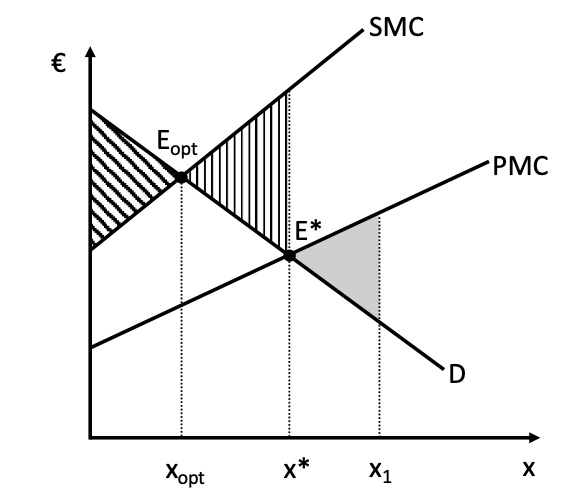
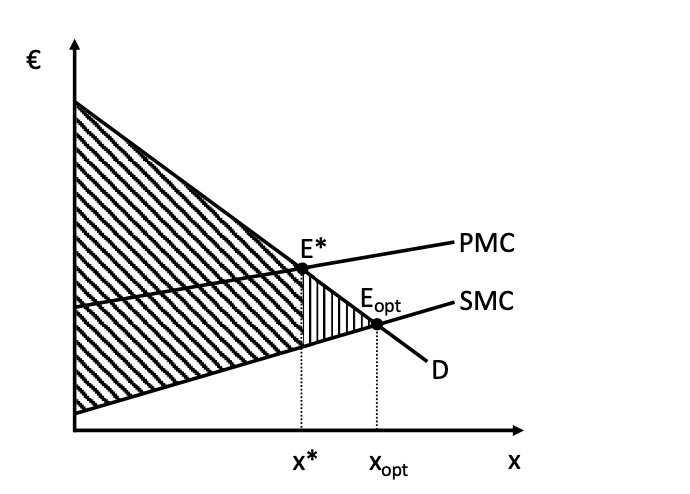
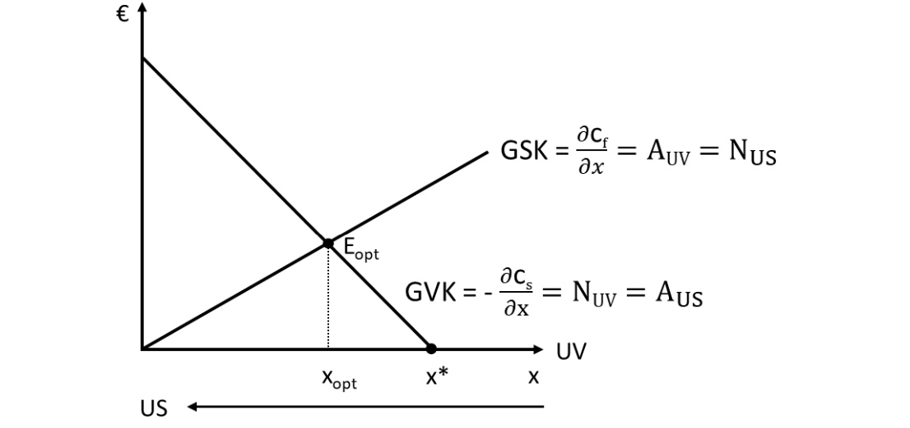
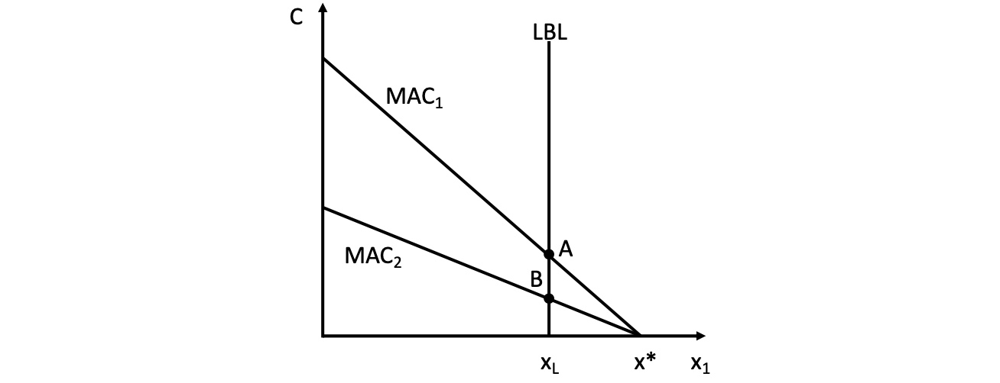
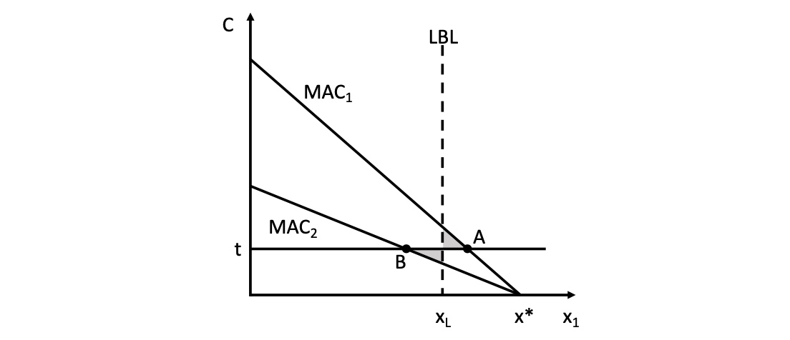
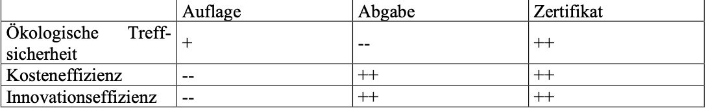

# 05.06.2022 Externe Effekte

Annahmen des mikroökonomischen neoklassischen Modells: Subjekte tragen Opportunitätskosten ihres Handels selbst

- wenn soziale Grenzkosten nicht kompensiert werden = **externe Effekte**
- Social Marginal Costs SMC > Producers Marginal Cost PMC

| negative Externalitäten                                   | positive Externalitäten                                   |
| --------------------------------------------------------- | --------------------------------------------------------- |
|  |  |

Verhinderung/Förderung der Externalitäten = Steuern / Subventionen

exakte Besteuerung sodass $E_{opt} = E^*$ = *Pigou-Steuer* 

- arbeitet nach Verursacherprinzip
- benötigt exakte Informationen


## Nutzungskonflikte

Beispiel: Stahlwerk mit Abwasser und Fischereidorf im Nutzungskonflikt

Modellierung:

- Stahlwerk mit Stahl *s* und Emissionen *x*
- Fischereibetrieb mit Produktion *f*


Gewinnfunktion des Stahlwerks:

- $G_s = p_s * s - c_s(s,x) \text{ mit } \frac{\partial c_s}{\partial x} < 0$
- d.h Vermeidungskosten von Emissionen (letzter Term)

Gewinnfunktion Fischerei

- $G_f = p_f * f - c_f(f,x) \text{ mit } \frac{\partial c_f}{\partial x} > 0$
- d.h Emissionsminderung führt zu steigender Produktion (letzter Term)

Zusammenfassung beider Unternehmen zu Konglomerat

$$
\begin{aligned}
G &= p_f * f + p_s * s - c_s(s,x) - c_f(f,x) \\

\frac{\partial G_s}{\partial s} &= p_s - \frac{\partial c_s}{\partial s} = 0 \to p_s = \frac{\partial c_s}{\partial s} \\

\frac{\partial G_s}{\partial f} &= p_f - \frac{\partial c_f}{\partial f} = 0 \to p_f = \frac{\partial c_f}{\partial s} \\

\frac{\partial G}{\partial x} &= \underbrace{- \frac{\partial c_s}{\partial x} - \frac{\partial c_f}{\partial x} = 0
}_{\text{Externer Effekt!}}
\end{aligned}
$$
Gesamtunternehmen müsste Grenzkosten der Fischerei als auch des Stahls berücksichtigen = *externer Effekt* wird internalisiert

Darstellung: 

- Grenzvermeidungskosten GVK = Grenzsozialkosten GSK
- für Stahlwerk optimale Emission $x^* > x_{opt}$
- Internalisierung => weniger Emissionen
- *US* = Umweltschutz




### Pigou Steuer

mögliche Handlungsoption gegen Umweltverschmutzung
$$
G_s = p_s * s - c_s(s,x) - t*x \\
\implies p_s = \frac{\partial c_s}{\partial s} \text{ und } t =  - \frac{\partial c_s}{\partial x}
$$
Problem: mangelnde Information vorab über perfekten Steuersatz

### Emissionsrechte

Variante I: Fischerei erhält Recht auf saubere Umwelt, verkaufbar gegen *q*
$$
G_s = p_s * s - c_s(s,x) - q*x \\
G_f = p_f * f - c_f(f,x) + q*x \\ 
p_s = \frac{\partial c_s}{\partial s} ;\ q = - \frac{\partial c_s}{\partial x} \\
p_f = \frac{\partial c_f}{\partial f} ;\ q = - \frac{\partial c_f}{\partial x} \\
$$
=> perfekter Internalisierung von Kosten

- oder Stahlwerk erhält Rechte
- auch genau gleiche Menge an Emission und Kosten
    - = **Coase-Theorem** (auch aus Einführung in VWL bekannt)
- distributive Auswirkung der Politik unterschiedlich, je nachdem wer Rechte erhält

Schlussfolgerung:

```
Staat sollte nicht eingreifen, sondern Rahmenbedingungen setzen (theoretisch). Alle Instrumente basieren jedoch auf der Annahme perfekter Informationslage der Grenzkosten für alle Beteiligten.

In Realität so selten gegeben, deswegen auch andere Instrumente sinnvoll, bspw. staatliche Mengenbegrenzungen etc.
```

## Auflagen und Abgaben

aufgrund von Informationsproblem Instrumente inzwischen auf politisch vorgegebenes Umweltziel fokussiert, statt "realer" gesellschaftlicher Kosten

Instrumente werden an 3 Kriterien gemessen:

- *ökologische Treffsicherheit:* lässt sich das Niveau punktgenau ansteuern?
- *Kosteneffizienz*
- *Innovationseffizienz*: Anreize für Fortschritt?


### Instrument I : Auflage

Maximal-**Auflage** für Firmen (Legal Base Line LBL)



- hier: 2 Unternehmen mit unterschiedlichem Einsparpotenzial
    - Grenzvermeidungskosten = Marginal Abatement Cost MAC
- beide müssen in gleichem Maße zurückschneiden = Ineffizienz

### Instrument II: Abgabe



- beide Unternehmen reduzierun um unterschiedliche Mengen
- regt zu Innovationen an
- bietet Einnahmequelle für Staat an = kosteneffizienter

### Intrument III: Cap + Zertifikatehandel

es wird Obergrenze (Cap festgelegt) und dann für die verbleibenden Emissionen Zertifikate  ausgeben + Handelsplatz

- ökologisch absolut treffsicher
- emissionsparende Firmen werden für Emission belohnt
- sehr kosteffizient
- Preis sortiert Unternehmen anhand als Einsparer oder Emittenten



