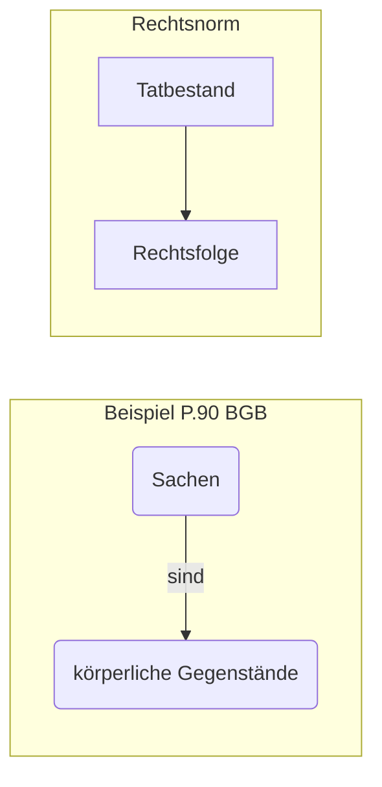

# 22.04.2022 Subsumtion

> **Subsumtion** *(in der Jur.)*: Anwendung einer Rechtsnorm auf Lebensachverhalt (Fall)
>
> => Unterordnung des Sachverhalts unter Normvoraussetzung

Beispiel:

```mermaid
graph LR
subgraph Beispiel P.90 BGB
1(Sachen) --sind-->  2(körperliche Gegenstände)
end
subgraph Rechtsnorm
Tatbestand --> Rechtsfolge
end
```

