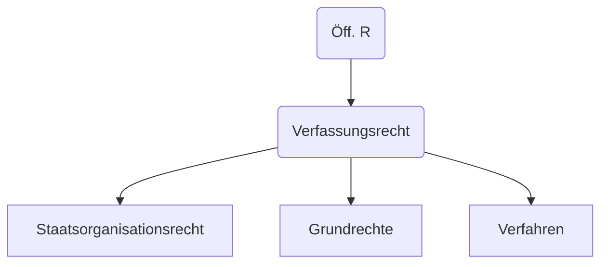

# 09.05.2022 Verfassungsrecht

Untergliederung

## Staatsorganisationsrecht

regelt Prinzipien, Aufbau, Funktionsweise des Staates

definierender Paragraf:

> **Art. 20 Grundgesetz:** 
>
> (1) BRD ist ein demokratischer und sozialer Bundesstaat
>
> (2) Staatsgewalt geht vom Volke aus , in Wahlen und Abstimmungen
>
> (3) Rechtsprechung folgt verfassungsmäßiger Ordnung

daraus entstehende Prinzipien

1. Republikprinzip
2. Sozialstaatsprinzip
3. Demokratieprinzip
4. Bundesstaatsprinzip
5. Rechtstaatprinzip

---

Demokratieprinzip:

- repräsentative Demokratie (Art. 38 GG)
- personalisierte Verhältniswahl
- Schutz von parlamentarischen Minderheiten
    - außer 5% Hürde

wie demokratisch sind Kanzlerin, Minister,...?

> **demokratische Legitimationskette:** jeder Entscheider staatlicher Angelegenheiten muss sich mittels Legitimationskette auf das Volk zurückführen

### Wahlgrundsätze

- **Frei:** Wahlentscheidung ohne Druck
- **geheim**: Wahlkabinen
- **unmittelbar**: direkte Entsendung der Vertreter
- **gleich:** jede Stimme gleichwertig 
- **allgemein:** alle Deutsche (über 18)

###  Verhältnismäßigkeitsprinzip

> **Verhältnismäßigkeit:** Kollidierende Rechtsprinzipien werden in Verhätlnis zueinander gesetzt, wenn wahrende Interesse schwerer wiegt als aufgeopferte

Abwägungsprozess

1. legitimer Zweck
2. Geeignetheit
3. Erfroderlichkeit
4. Angemessenheit

