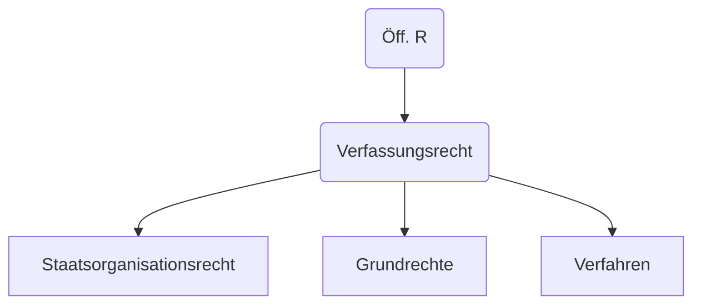

# 09.05.2022 Verfassungsrecht

Untergliederung

```mermaid
graph TD
V(Verfassungsrecht) --> Staatsorganisationsrecht & Grundrechte & Verfahren
O(Öff. R) --> V
```

## Staatsorganisationsrecht

definierender Paragraf:

> **Art. 20 Grundgesetz:** demokratischer Bundesstaat, Staatsgewalt vom Volke, Rechtmäßigkeit

