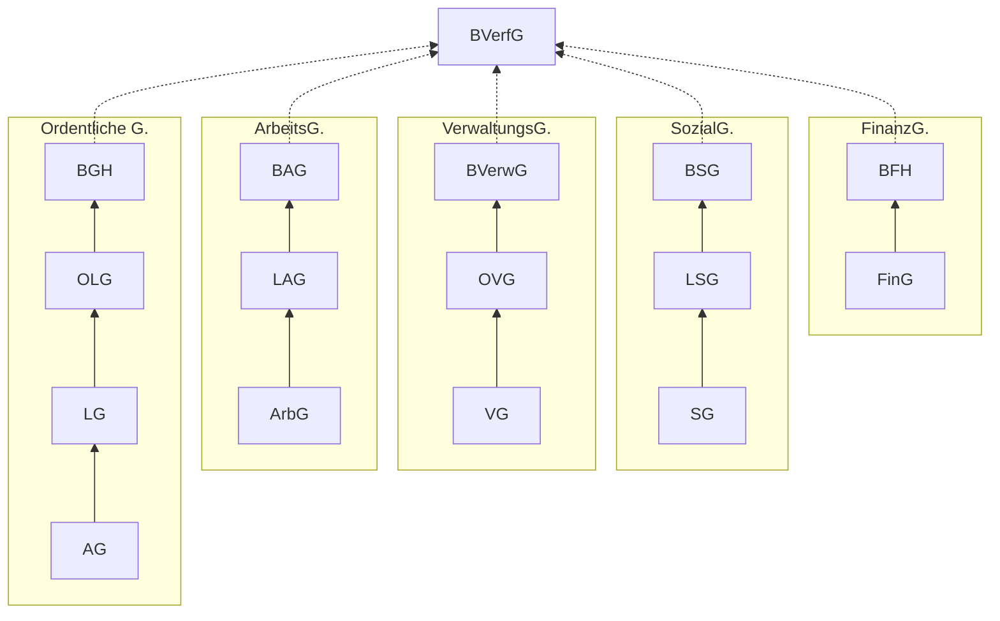

# 17.06.2022 Verfassungsprozessrecht

### Gerichtsorganisation in BRD

Gerichtsorganisation nach `Art. 92. GG`

**merke:** BVerfG ist keine Superrevisionsinstanz (die können Fälle ablehnen)

### Verfahren vor dem BVerfG

- Verfassungsbeschwerde nach `Art. 93 I 4` (jedermann):
    - Öffentliche Gewalt greift in Grundrechte ein
- konkrete Normenkontrolle `Art. 100`: 
    - Überprüfung eines Gesetzes nach Richtervorschlag 
- abstrakte Normenkontrolle `Art. 93 I 2`: 
    - Überprüfung eines Gesetzes nach Aufruf durch Parlamente
- Organstreit `Art. 93 I 1`: 
    - zwischen staatlichen Stellen
- Bund-Länder Streit `Art. 93 I 4`:
    - Kompetenzabrenzung zwischen BUndesländern spezifisch

formale Zulässigkeit:

- Zuständigkeit des BVerfG
- Beschwerdefähigkeit
- Verfahrensfähigkeit
- Beschwerdegegenstand
- Beschwerdebefugnis
- Rechtswegerschöpfung (Subsidiaritätsprinzip)
- Frist von 1 Jahr (Gesetz)

