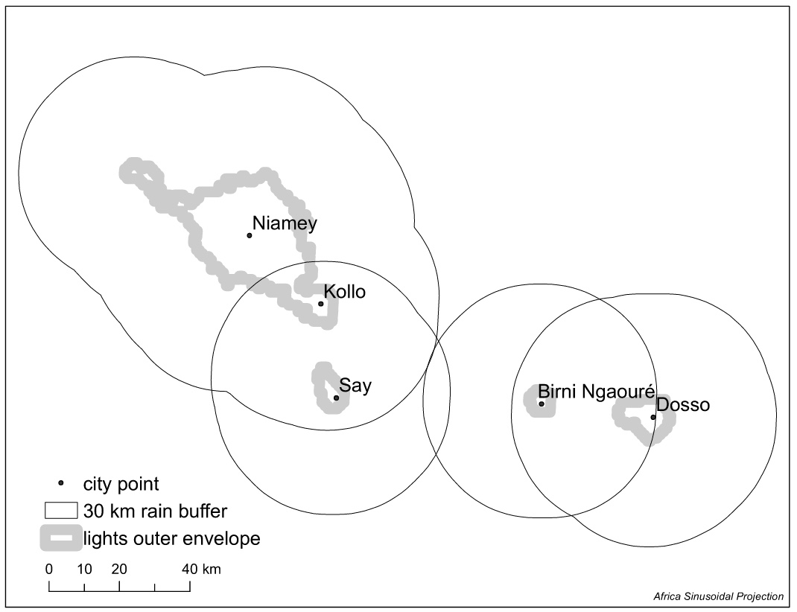

## Überblick

Paper: **Has Climate Change driven Urbanization in Africa?**

Übersetzung: **Hat der Klimawandel die Urbanisierung in Afrika vorangetrieben?**

Veröffentlichung: **Journal of Urban Economics, 2016**

Autoren:

- J. Henderson  (London School of Economics)
    - bekannter Forscher, schon oft aufgetaucht in diesem Seminar
- Uwe Deichmann, *World Bank*
- Adam Storeygard, *Tufts University*

## Hintergrund

### Forschungsfragen

- Führen ungünstige Klimaveränderungen dazu, dass die Menschen aus den ländlichen Gebieten in die Städte ziehen?
- Führt dieser Zuzug zu (Gesamt-)Einkommensteigerungen in Städten?
    - aufgeteilt nach Städten mit industrieller Basis und ohne

*Kann Urbanisierung ein Ausweg in veränderten Klimabedingungen sein?*

### Forschungstand

vergleichsweise dürftiger Stand, trotz extrem wichtiger Frage 

Probleme existierender Paper: (zu exakt dieser Frage)

- Daten auf nationaler Ebene (trotz signifikanter Inlands-Variation)
- mangelnde Bevölkerungsdaten, die auf stark Interpolierung basieren

Forschung zu Effekt von Klimawandel auf Afrika:

- Afrika hat sehr diverses Klima (hyperaride Sahara, humide Tropen Zentralafrika)
- Vorhersagen:
    - Fläche betroffen von Hitzeextrema steigt auf 45%
    - extreme Hitzesteigerung in bereits warmen Regionen
    - sinkende Niederschlagsmengen
        - Ernteeräge sinken um 8-15%

### Abgrenzung des Papers

- neue Datenbasis und Beantwortung der Kombination beider Forschungsfragen
    - Datenbasis später vorgestellt
- in wenig erforschtem Bereich (Klimawandel ~ Urbanisierung : Afrika)


## 1. Frage: Klimawandel ~ Urbanisierung

### Daten

generelles Problem der Datenlage in afrikanischen Staaten

#### Bevölkerung

- Bevölkerungsdaten für sub-nationale Distrikte anhand von Bevölkerungszählung / Zensus
- nur Länder mit 2-5 Zählungen zwischen 1960 und 2010
    - insgesamt 29 Länder in Sample
- daraus 369 Distrikte mit durchschnittlikch 41.100 Qkm Fläche

Darstellung: 

#### Klima

- Messgröße Klimaveränderung: Moisture / Feuchtigkeit
    - Niederschlag geteilt durch potentielle Verdunstung 
    - Indikator für landwirtschaftliches Nutzungspotential
- Quelle: University Delaware Climate Data Set

Darstellung: 

#### Industrieller Grad

- sehr schwache Datenlage
- Quelle: Oxford Regional Economic Atlas (1965)
    - sehr intelligente Datenwahl, umfangreiche Kartographierung
    - kartiert 26 verschiedene Industrien in Afrika
    - davon 15 "modern" (nicht industrielle Verabreitung landwirtschaftlicher Erzeugnisse wie Destillation)
- 19 der Untersuchten Länder haben min. eine Industre
- 23 % der Distrikte


### Regressionsmodell:

$$
u_{ijt} = \beta_0 w_{ijt} + \beta_1 X_{ij} + \beta_2 X_{ij} \ w_{ijt} + \alpha_{jt}+ \varepsilon _{ijt}
$$


- Distrikt *i*, land *j*, Jahr *t*
    - U = Wachstum der städtischen Bevölkerung
    - w = Feuchtigkeit
    - x = zeit invariante Kontrollen
    - a = Fixed Effect für Land und Jahr
    - e = Fehler Term

Ergebnisse: 


Interpretation: Einfluss einer Feuchtigkeitsveränderung auf Urbane Bevölkerung

*was passiert, wenn die Feuchtigkeit sinkt?*

- von Interesse ist erste Zeile
- 1 Spalte: Einfluss auf alle Städte im Schnitt
    - nicht statistisch signifikant
    - wenn die Feuchtigkeit sinkt, hat das keinen generisierbaren Einfluss auf eine Stadtbevölkerung
- 2 Spalte: auf Städte mit modernen Industrien (nicht landwirtschaftlich)
    - statistisch signifikant
    - steigt die Feuchtigkeit, sinkt die Stadtbevölkerung
    - oder andersrum: Sinkt die Feuchtigkeit (was sie historisch tut), steigt die Stadtbevölkerung 
- 3 Spalte: Städte mit Industrie insgesamt
    - ähnlich zu Spalte 2

nochmal in verständlicher Weise als Graphik: 

=> je mehr Industrien ein Distrikt hat, desto stärker wirkt eine Feuchtigkeitsveränderung auf das Wachstum der Stadtbevölkerung

```
Interpretation: Eine Erhöhung der Feuchtigkeit um eine Standardabweichung => steigert die städtische Wachstumsrate um 0.015
```


Robustness Checks:

- ob gewaltsame Konflikte einen Einfluss haben
    - Verschlechterung Landwirtschaft -> Konflikt -> Verstäderunt
    - keinen Effekt
- Entfernung zur Küste (weil Einfluss auf Niederschlag)
    - aber keine Korrelation mit Industriedichte


## 2 Frage: Urbanisierung ~ Einkommen der Stadt

Jetzt: Einfluss der jährlichen Klimaveränderung auf jährliches Gesamteinkommen der Stadt

## Daten

### Einkommen

- Lichtemissionen aus US Defence Meteorological Satellite Program (DMSP) als Indikator für Einkommen
- von 1992 - 2008
- nicht mehr Distrikte, sondern einzelne Städte und ein 30km Umkreis
    - 1158 Städte in 42 Ländern



### Niederschlag

- von Africa Rainfall Climatology Version 2
    - genauere Auflösung, aber kürzere Zeitspanne als vorher

### Modell

$$
\ln(light_{it}) = \sum_{j=0}^k \beta_j \ln(rain_{i,t-j}) + \sum_{j=0}^k \gamma_j X_i^` \ln(rain_{i,t-j}) + \phi_i + \lambda_t + a_i t + \epsilon_{it}
$$

- Lichtindex summiert über Stadt und Jahr
- Niederschlag in Stadt i,  über 3 Jahre geglättet
- $x$ = time invariant city controls
- $\phi$ Fixed effects auf Stadt
- $a_i t$ Stadspezifischer linearer Trend

hier wird nur auf Fluktuation von Jahr zu Jahr geschaut, mit Niederschlagswerten über 3 Jahre gemittelt

kürzere Periode, die später startet

Ergebnisse: 

1. Spalte: Effekt auf alle Städte
2. Spalte: Effekt auf industrialisierte Städte (Messung mithilfe der vorangegangen Atlaszahlen)

- genereller Effekt nicht statistisch signifikant
- aber Städte mit Industrien: 
    - Steigerung der Niederschlagsmenge => niedrigere Lichtemissionen
    - oder andersrum: Abschwächung Niederschlag => höhere Lichtemissionen

```
Interpretation Log-Log:
Eine Erhöhung der Niederschlagsmenge um eine Standardabweichung reduziert Lichtemissionen um 11% und Einkommen um 3.5%
```

Robustness Checks:

- gegen Fluten 
    - keinen signifikanten Effekt
- und Städte, die mit Wasserkraft versorgt werden
    - aber da meist nationales Stromnetz mit gleichen Preisen irrelevant


## Schlussfolgerung und Bewertung

Bewertung:

- Paper stellt erweitert den Forschungstand auf jedenfall
- hochrelevant für aktuelle Zeit
- leider Verbindung beider Fragen nicht so gut geklappt, aufgrund komplett unterschiedlicher Daten und Zeiträume
- sehr interessante Quelle für Stand der Industrialisierung
    - leider etwas veraltet, es hat sich seit den 60ern dann doch etwas getan
    - betont auch in Einleitung, dass es ein Tip eines guten Kollegen war

Schlussfolgerung:

- Afrika wird von Klimawandel hart getroffen
- bereits jetzt nur marginal geeignet für landwirtschaftliche Produktion
- industrialisierte Distrikte können Klimawandelfolgen entgehen
    - Jedoch: Afrika wenig strukturelle Transformation
    - und einhergehend mit intensiver Industrie ist Verschmutzung, die damit nicht übersprungen werden kann (Leapfrogging)
- Folgen für landwirtschaftliche Produktion können mithilfe von verstärkter Adaption von Dünger und Bewässerung aufgefangen werden
    - sehr geringe Verbreitung und  quasi kein Wachstum seit 80ern

