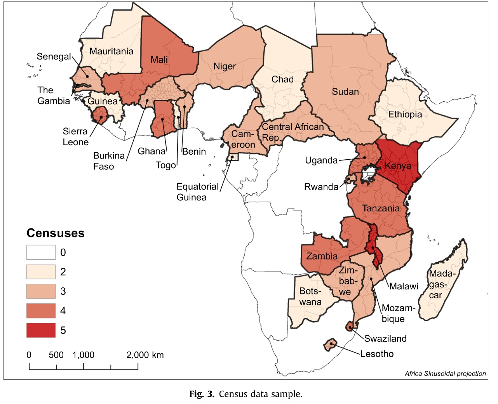
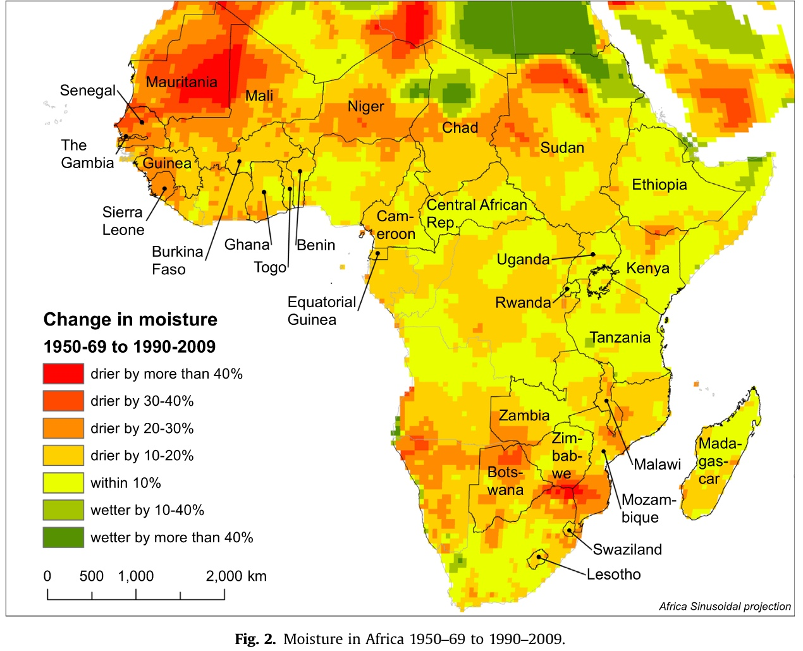

# Lesenotizen

**Has Climate Change driven Urbanization in Africa?**

- J. Vernon Henderson, *LSE, UK*
- Adam Storeygard, *Tufts University, US*
- Uwe Deichmann, *World Bank*

- Veröffentlicht September 2016
- Journal of Development Economics

> **Abstract:** This paper documents strong but differentiated links between climate and urbanization in large panels of districts and cities in Sub-Saharan Africa, which has dried substantially in the past fifty years. The key dimension of heterogeneity is whether cities are likely to have manufacturing for export outside their regions, as opposed to being exclusively market towns providing local services to agricultural hinterlands. In regions where cities are likely to be manufacturing centers (25% of our sample), drier conditions increase urbanization and total urban incomes. There, urban migration provides an “escape” from negative agricultural moisture shocks. However, in the remaining market towns (75% of our sample), cities just service agriculture. Reduced farm incomes from negative shocks reduce demand for urban services and derived demand for urban labor. There, drying has little impact on urbanization or total urban incomes. Lack of structural transformation in Africa inhibits a better response to climate change.

2 Questions: 

- Do adverse changes in climate push people out of rural areas into cities?
- does this push increase total income of cities

=> does urbanization provide an escape in changing climates?

### 2: Literature

shortcomings of existing papers: (on this question)

- use national data
    - even though significant within country climate variation
- population data based on 10-year intervals and interpolation!
    - not good data basis
- or use microdata like surveys (a lot of risks)

papers on climate change

- africa is diverse
    - hyperarid sahara - humid tropics of central africa
- predictions:
    - temperature increase by 1.5° In 2° scenario
    - are with heat extrames to 45 %
    - falling precipitation

on agriculture 

- yield losses 8-15 %
- up to 47% for wheat
- less adaptation with fertilisers
    - stagnated with 19080
- only 4% irrigation 

### 3: Modell

**das Modell hat nichts mit der Empirie zu tun, haben sie nur einfach so noch drin!**

Districts:
- small open economies
- only in-district migration!

- consist of city and rural sector
- Arbitrage between city and rural
    - full emplyoment
    - equal income

City:

- services industry (not traded)
    - constant returns to scale
- (maybe) manufacutring industry
    - exporting goods out of district
    - economies of scale
- diseconomies of commuting

rural sector:

- agricultural products = fixed prices in international markets

Ergebnisse nach auflösung des Modells

1. city has manufacturing:
    - decline in moisture -> increase urban pop.
    - increase total city income
2. city has no manufacturing
    - decline in moisture -> no effect
    - total city income declines

### 4: Data

really scarce data in Africa

##### Population

- population measures for sub-national districts from *censuses*
    - not distinguishable between migration and births etc
- 29 countries with 2 to 5 censuses between 1960 and 2010
- 369 districts ; average 41100 sq km

##### climate and precipitation

- measurement used: Precipitation divided by potential evapotranspiration = climatic agricultural potential measurement
- Source: University Delaware climate data set

##### Industrial extent

- very scarce data!
- Oxford Regional Economic Atlas (1965) Ady
    - maps industries in africa
    - 26 different industries 
        - 15 of these "modern" (not based on agricultural processing)

- 19 countries have a industry
- 23 % of Districts have idnustrial base
    - shared between arid and non-arid

### 5a: Empirical Analysis. Effect of climate on urbanization

natürlich Regressionsmodell  , was sonst

- Variablen: district i, country j, year t
- $u_{ijt} = \beta_0 w_{ijt} + \beta_1 X_{ij} + \beta_2 X_{ij} \ w_{ijt} + \alpha_{jt}+ \varepsilon _{ijt}$
    - u = growth of urban pop.
    - w = moisture
    - X = time invariant controls
    - a = country year fixed effect
    - e = error term

