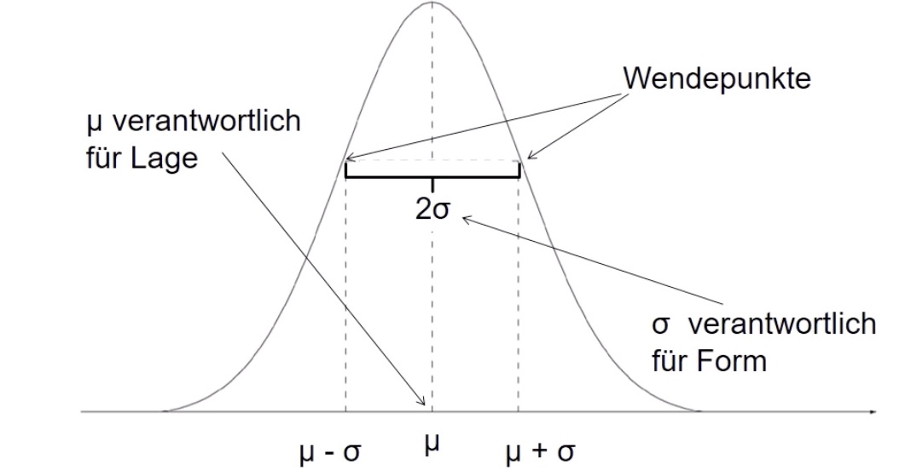

# 27.05.2022 Gaussche Normalverteilung

"Fehlerverteilung", oft in Naturwissenschaften

- Dichtefunktion: $f(x)= \frac{1}{\sqrt{2\pi} * \sigma} * exp \Big( - \frac{(x-\mu^2)}{2 \sigma^2}\Big)$
- Erwartungswert = $\mu$
- Varianz = $\sigma^2$

graphische Darstellung:

**beachte**: 

- Kurve konvergiert gegen 0, erreicht aber nicht 
- Fläche unter Kurve = 1

## Standardnormalverteilung

Falls $\mu = 0$ und $\sigma^2 = 1 \to$ N(0,1) = *Standardnormalverteilung*

- Dichtefunktion: $f(x)= \frac{1}{\sqrt{2\pi}} * exp \big( - \frac{x^2}{2}\big)$
- Bezeichnung: $\Phi(x)$

### Standardisierung

Verteilung X auf Standardnormalverteilung N(0,1) formieren
$$
X \sim N(\mu, \sigma^2) \implies Z \sim N(0,1) \\
Z =\frac{X-E(X)}{\sqrt{Var(X)}} = \frac{X-\mu}{\sigma}
$$

### Symmetrie

Dichte der Normalverteilung ist "symmetrisch"

Also: $\Phi(-z) = 1- \Phi(z)$

## Berechnung von Wahrscheinlichkeiten

$P(a \le X \le b)$ Gegeben $X \sim N(\mu, \sigma^2)$ ?

### bei Standardnormalverteilung:

$\implies P(a \le X \le b) = F(b) - F(a) = \Phi(b)- \Phi(a)$

Nun bestimmung mithilfe von Rechnern / Tabellen

vorgegeben in Klausuren / Skript: 

### nicht Standardnormalverteilung

wenn nicht Standardnormalverteilung => **transformieren** *(auch die Grenzen a, b)*
$$
P(a \le X \le b) = 
P\Big(\frac{a-\mu}{\sigma} \le \frac{X-\mu}{\sigma} \le \frac{b-\mu}{\sigma} \Big) \\
= P\Big(\frac{a-\mu}{\sigma} \le Z \le \frac{b-\mu}{\sigma} \Big) = 
\underbrace{ \Phi \Big(\frac{b-\mu}{\sigma} \Big)- \Phi \Big(\frac{a-\mu}{\sigma} \Big)}_{\text{Grenzen transformieren!}}
$$
oder $P(X \le x) = \Phi \big(\frac{x- \mu}{\sigma} \big)$

### Beispiele

Standardnormalverteilung:
$$
P(Z \le -0.8) = \Phi(-0.8) = 1 - \underbrace{ \Phi(0.8)}_{\text{Tabelle}} = 1- 0.7881 = \bold{0.2119} \\
$$
Normalverteilung: 
$$
\begin{aligned}
X \sim N(4,49) &\implies \mu = 4; \sigma = \sqrt{49} = 7  \\
\\
P(X \le 5) 
&= \Phi \Big(\frac{x-\mu}{\sigma} \Big) 
= \Phi \Big(\frac{5-4}{7} \Big)  \\
&= \Phi(1/7) \\
\\
P(3 \le X \le 5) 
&= \Phi \Big(\frac{5-4}{7} \Big) - \Phi \Big(\frac{3-4}{7} \Big) \\
&= \Phi \Big(\frac{1}{7} \Big) - \Phi \Big(-\frac{1}{7} \Big) \\
&= \Phi \Big(\frac{1}{7} \Big) - \Big[1- \Phi \Big(\frac{1}{7} \Big)\Big] \\
&= 2 * \Phi \Big( \frac{1}{7} \Big) -1 = 0.1138
\end{aligned}
$$
