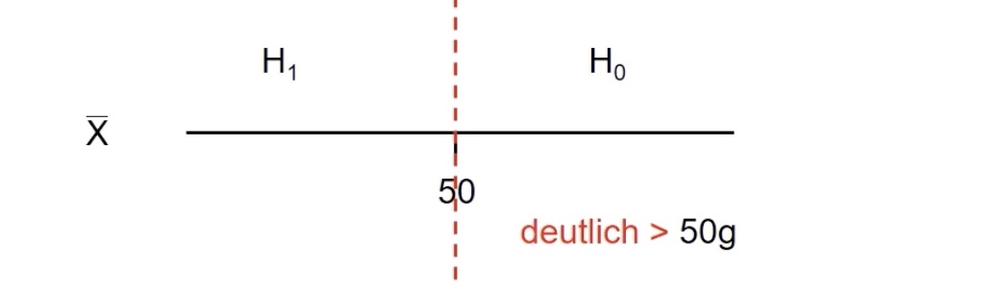

# 20.06.2022 Tests 2

## Ablauf eines Tests

- Testproblem mit 2 Thesen $H_0$ und $H_1$
- Signifikanzniveau $\alpha$, meist *0.01, 0.05, 0.1*
- **Zufalls**stichprobe 
- Berechnung Teststatistik
- Entscheidungsregel anwenden

---

**Beispiel**: sind Brötchen vom Bäcker zu leicht (weniger als 50g)?

- Brötchengewicht X
- Annahme $X \sim N(\mu, \sigma^2)$, hier $\sigma^2 = 1.44$
- Behauptung Bäcker: $\mu = 50$
- $H_0: \mu \ge 50$ (zufrieden) vs. $H_1: \mu < 50$ (unzufrieden)

statistische Modellierung:

- Kunde zieht Stichprobe vom Umfang n: $X_1, ...,X_n$
- $\bar{X}$ = Durchschnittsgewicht = Prüfgröße

 

## Hypothesentests

mit $\mu$ der zu überprüfende Wert und $\mu_0$ der reale Wert

| Test         | Hypothese $H_1$ | Gegenhypothese $H_1$ | $H_0$ Ablehnen, falls                                        |
| ------------ | --------------- | -------------------- | ------------------------------------------------------------ |
| linksseitig  | $\mu \ge \mu_0$ | $\mu < \mu_0$        | $\sqrt{n}*\bigg| \frac{\bar{X}- \mu_0}{\sigma}\bigg| > z_{1-\frac{\alpha}{2}}$ |
| rechtsseitig | $\mu \le \mu_0$ | $\mu > \mu_0$        | $\sqrt{n}*\frac{\bar{X}- \mu_0}{\sigma}< -z_{1-\alpha}$      |
| Zweiseitig   | $\mu = \mu_0$   | $\mu \ne \mu_0$      | $\sqrt{n}*\frac{\bar{X}- \mu_0}{\sigma}> z_{1-\alpha}$       |

Beispiel Rechtsseitige Hypothese: Behauptung, dass mehr als 50% der Menschen Mathe lieben

Beispiel linksseitige Hypothese: Brötchenbeispiel Verbraucher stellen Gegenhypothese auf

