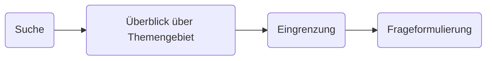

# 22.04.2022 Themenfindung

der Prozess der Themenfindung:

## Suche

Themensuche abhängig von:

- Anspruch + Zielsetzung der Arbeit
- Schwerpunkte der wiss. Arbeit
- Menge an Literaturauswahl

immer Absprache mit Betreuer!

### vorgegebenes Thema

toll, die schwere Arbeit fällt schonmal weg :)

- Interessante Unterthemen identifizieren
- Verknüpfungen mit bekannten Themen
- mögliche Gegenpositionen

### freie Wahl

achten auf:

- keine persönlichen Themen
- Quellenlage
- zu abstrakt

